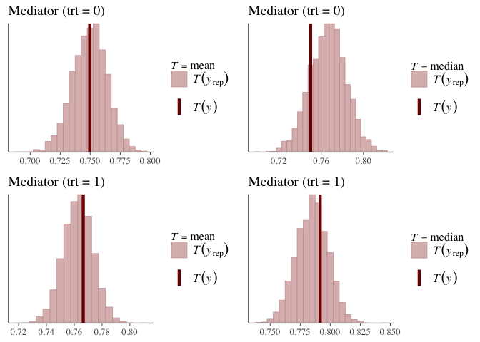
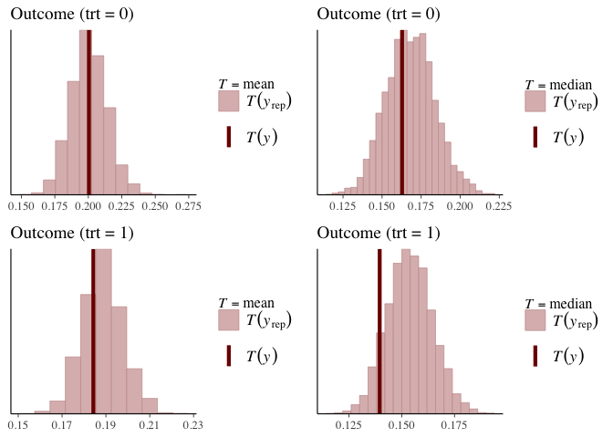

  
```{css, echo=FALSE, include = FALSE}
pre, code {white-space:pre !important; overflow-y:auto}
```

```{r setup, include=FALSE}
knitr::opts_chunk$set(echo = TRUE)
```

\newcommand*{\indep}{\perp \!\!\! \perp}


## Purpose

This code implements a Bayesian approach to causal mediation analysis, using a zero-one inflated beta regression model in STAN. To illustrate the method, the JOBS II data is used. This dataset can be found in the R package [`mediation`](https://cran.r-project.org/web/packages/mediation/index.html). The JOBS II study was a randomized field experiment that investigated the efficacy of a job training intervention on unemployed workers. In this dataset there are 899 observations, containing no missing values. The potential outcome variable, `depress2`, is a continuous measure of depressive symptoms post-treatment (participation in job-skills workshops). The mediator variable, `job_seek`, is a continuous measure of job search self-efficacy. The treatment variable, `treat` is an indicator variable for whether the participant was randomly selected for the JOBS II training program. 


## Pre-process data

For pre-processing of the data, the predictors are scaled using the R function `scale`. The scaled matrices are designed to include a column for the intercept. Both the mediator and the outcome variables are scaled to be between 0 and 1.

```{r user_functions, include = FALSE}
# options (future.globals.maxSize = 4000 * 1024^5)
## theme for effect plots
source('/Users/rene/Documents/Dissertation/Essay/Images/theme_border_function.R')

normalize <- function(x){ 
  return((x- min(x)) /(max(x)-min(x)))
}
round_df <- function(x, digits) {
  # round all numeric variables
  # x: data frame 
  # digits: number of digits to round
  numeric_columns <- sapply(x, class) == 'numeric'
  x[numeric_columns] <-  round(x[numeric_columns], digits)
  x
}
get_piece <- function(y) {
  
  if(is.null(dim(y))){
    idx <- which(y == 0 | y == 1)
    yc0 <- y[which(y == 0)]
    yc1 <- y[which(y == 1)]
    yc <- y[idx]
    yd <- y[-idx]
    # return(list(vardens = yc, vardisc = yd))
    return(list(var0 = yc0, var1 = yc1, var01 = yc, dens = yd))
  }else{
    yc0 <- sapply(1:dim(y)[1], function(i){ 
      idx <- which( y[i,] == 0)
      y[i, idx]
    })
    yc00 <- unlist(sapply(which(lengths(yc0) != 0),
                          function(i) yc0[[i]]))
    
    yc1 <- sapply(1:dim(y)[1], function(i){ 
      idx <- which(y[i,] == 1)
      y[i, idx]
    })
    yc11 <- unlist(sapply(which(lengths(yc1) != 0),
                          function(i) yc1[[i]]))
    #yc <- c(yc00,yc11)
    # min(lengths(yc))
    
    yc <- unlist(sapply(1:dim(y)[1], function(i){ 
      idx <- which(y[i,]  == 0 | y[i,]  == 1)
      y[i, idx]}))
    
    yd <- unlist(sapply(1:dim(y)[1], function(i){ 
      idx <- which(y[i,]  == 0 | y[i,]  == 1)
      y[i, -idx]}))
    return(list(var0 = yc00, var1 = yc11, var01 = yc, dens = yd))
  }
}

prop_data <- function(pred, itr = 100){
  if(is.null(dim(pred))){
    
    var_t0 <- mean(pred == 0)
    var_t1 <- mean(pred == 1)
    var_t99 <- mean(pred > 0 & pred < 1)
    
    i0 <- as.factor(rep(0,length(var_t0)))
    i1 <- as.factor(rep(1,length(var_t1)))
    i99 <- as.factor(rep(99,length(var_t99)))
    
    varout <- rbind.data.frame(
      cbind.data.frame(vprob = var_t0, var = i0), 
      cbind.data.frame(vprob = var_t1, var = i1), 
      cbind.data.frame(vprob = var_t99, var = i99)
    )
    
  }else{
    
    # x <- pred[i, data_index, trt_index]
    var_t0 <- sapply(1:itr, function(i){
      mean(pred[i,] == 0)
    })
    var_t1 <- sapply(1:itr, function(i){
      mean(pred[i,] == 1)
    })
    var_t99 <- sapply(1:itr, function(i){
      mean(pred[i,] > 0 & pred[i,] < 1)
    })
    
    i0 <- as.factor(rep(0,length(var_t0)))
    i1 <- as.factor(rep(1,length(var_t1)))
    i99 <- as.factor(rep(99,length(var_t99)))
    
    varout <- rbind.data.frame(
      cbind.data.frame(vprob = var_t0, var = i0), 
      cbind.data.frame(vprob = var_t1, var = i1), 
      cbind.data.frame(vprob = var_t99, var = i99)
    )
    
  }
  return(varout)
}

graph_hist <- function(pred, obs, namevar, trt){
  clr <- c('red', 'gold') 
  if(min(pred$vprob) == 0){
    lim = c(-.01,.21)
  }else{
    lim = c(.75,1)
  }
  
  # titlename <- paste0('Histogram of Proportions for ', namevar,' Values of 0 and 1 \n (Treatment = ', trt, ')')
  titlename <- paste0(namevar,' where Treatment = ', trt)
  
  if(tolower(namevar) == 'mediator'){
    labelvar = 'm'
  }else{
    labelvar = 'y'
  }
  
  label1 = paste0(labelvar, " = 0")
  label2 = paste0(labelvar, " = 1")
  label3 = paste0("0 < ", labelvar, ' < 1')
  
  gh <- ggplot(pred, aes(x = vprob, 
                         group = var, 
                         fill = var)) +
    geom_histogram( position = 'identity')  + 
    theme_bw() +
    geom_vline(data = obs, aes(xintercept = vprob, 
                               color = "pink3",
                               linetype = labelvar),
               color = "pink3",
               size = 1.3,
               show.legend = TRUE) +
    scale_linetype_discrete(name = "Observed \n Proportions") +
    scale_fill_manual(name = 'Predicted \n Proportions ',
                      labels = c(label1, label2, label3),
                      values = c("0" = "indianred4",
                                 "1" = "royalblue4",
                                 "99" = "darkseagreen4"))  +
    labs(x = 'Proportion',
         y = 'Frequency',
         color = 'Predicted Values',
         title = titlename) +
    scale_x_continuous(# breaks = seq(0,.2 + 0.01, by= .01),
      # expand = c(0.1,0.1),
      limits = lim) +
    scale_y_continuous(expand = expansion(mult = c(0, .1))) +
    guides(fill = guide_legend(override.aes = list(linetype = 0)),
           color = guide_legend(override.aes = list(linetype = 0))) #+
    # theme(text = element_text(size = 12))
  
  return(gh)
}

```


```{r preprocess_rdata, ggplot2, message = F, warning = F}
library(rstan)
rstan_options(auto_write = TRUE)
library(mediation)
library(ggplot2)
library(tictoc)
library(bayesplot)
library(kableExtra)
library(ggpubr)
library(forcats)
require(reticulate)
# library(shinystan)
library(tidyr)
library(grid)


data(jobs); invisible(names(jobs))
num_seed = 1810201

## create data 
scaled_z <- scale(jobs[,c('econ_hard','sex','age')])
trt <- jobs$treat

## scale mediate and outcome
y <- normalize(jobs$depress2)
med <- normalize(jobs$job_seek)

qplot(y, geom = 'histogram', binwidth = .025, ylab = 'Frequency', xlab = 'Measure of Depression', fill=I('white'), col=I('blue')) + theme_bw() + theme(panel.grid.minor = element_blank())
qplot(med, geom = 'histogram', binwidth = .025, ylab = 'Frequency', xlab = 'Measure of Confidence/Self- Efficacy in Job Search', fill=I('white'), col=I('blue')) + theme_bw() + theme(panel.grid.minor = element_blank())

```

## Causal Mediation Analysis
### Potential/ Counterfactual Framework
Using the potential (counterfactual) outcome framework, the causal effect of the job training program can be defined as the difference between two potential outcomes. One potential outcome is realized if the subject participates in the training program and the other potential outcome is realized if the subject does not participate. 

Suppose we use $Y_i$ to represent the measure of depression for the $i^{th}$ subject, $M_i$, the measure of confidence/self efficacy in the job search for the $i^{th}$ subject, and $A_i$, the binary indicator variable for the $i^{th}$ subject's treatment/participation in the JOBS II training program; $A_i$ takes on the values of $a= 1$ (participation in the training) or $a = 0$ (otherwise). The depression level of subject $i$ is independent of subject $j$ ($i \ne j$). In addition, since the treatment in the JOBS II study is randomized, $A_i$ is statistically independent of the potential outcomes; we can write this as $\left(Y_i(0),Y_i(1) \right) \indep{}  A_i$. The observed value for the depression level can be denoted by $Y_i$, where $Y_i = Y_i^{A_i}$, which can result in two potential values. For example, $Y_i(1)$ would be the observed depression level for subject $i$, if subject $i$ actually participated in the training program; in this case, the unobserved outcome for subject $i$ is the level of depression if they did not participate in the training program. We will use $Y_i(a)$ to represent the potential level of depression that would result under the treatment status $a$ for subject $i$. In addition, in causal mediation analysis, the potential outcome also depends on the mediator. In the context of this study, this implies that the level of job search self-efficacy can be affected by participation in the program, which can be represented by $M_i(a)$; which also has two potential values $M_i(0)$ and $M_i(1)$. The potential mediator value of subject $i$ are independent of the treatment status for subject $j$ ($i \ne j$). Therefore, we will update the potential outcome to be denoted as $Y_i(a, M_i(a))$ and also note that the potential outcome for subject $i$ is independent of both the treatment status and the mediator value of subject $j$ ($i \ne j$).

### Causal Mediation Effects
The statistical independence between the treatment assignment and the potential outcome allows us to compute the average causal effect as the observed mean difference between the treatment and control group: 
<center>$$E[Y_i(1)-Y_i(0)] = E[Y_i(1)|A_i = 1] - E[Y_i(0)|A_i = 0] \quad (average \;causal \; effect)$$</center> 

Under the counterfactual/potential outcome framework, only one potential outcome of $Y_i(a, M_i(a))$ is observed, which we will denote by $Y_i(A, M_i(A))$. Let $Z_i$ be a vector of baseline covariate for each subject $i$ and $\mathcal Z$ be the support of the distribution of $Z_i$; in addition, the support of $M_i$ is $\mathcal{M}$. To identify the effects of treatment and mediation, we assume sequential ignorability, as per Imai et al, by assuming the following two statements of conditional independence hold:

<center>
$$\Bigl \{ Y_i( a', m), \; M_i( a) \Bigr \} \indep{} A_i|Z_i=z \qquad  (1) \\
Y_i( a', m) \indep{} M_i(a)|A_i = a,Z_i = z \qquad (2)$$
</center>

where $P(A_i=a|Z_i=z) > 0$ and $P(M_i(a) = m|A_i=a,Z_i=z) > 0$ for $a = 0, 1$, and, all $z \in \mathcal{Z}$ and $m \in \mathcal{M}$.

These ignorability assumptions are made sequentially. The first part of the assumption assumes that given the observed confounders, prior to treatment, the treatment \underline{assignment} is ignorable. In terms of statistical independence, the observed pre-treatment is independent of the potential outcomes and potential mediators. The second part of sequential ignorability states that the mediator is ignorable given the observed treatment and pre-treatment confounders; meaning that the potential outcome and mediator are unconfounded on the past observations and confounders.  


The indirect effect of the treatment on the outcome, through the mediating variable is defined as the causal mediation effect (Imai et al., 2010), for $a = 0, 1$:
<center>$$\quad \delta_i(a) \equiv Y_i(a, M_i(1)) - Y_i(a, M_i(0))  \\ (causal \; mediation/ natural\; indirect \; effect)$$</center>

The following definitions are defined as the effect of the treatment $(a = 0, 1)$, on the outcome, through the mediation variable:

The average causal mediation effect is defined by:
<center>$$\qquad \overline{\delta}(a) \equiv E\left[Y_i(a, M_i(1)) - Y_i(a, M_i(0)\right]  \\ 
(average \; causal \; mediation/ natural\; indirect \; effect)$$</center>

The direct effect is defined by:
<center>$$\zeta_i(a) \equiv Y_i(1, M_i(a )) - Y_i(0, M_i(a ))  \\
\qquad (natural\; direct \; effect)$$</center>

The average direct effect is defined by:
<center>$$\overline{\zeta}(a) \equiv E\left[Y_i(1, M_i(a)) - Y_i(0, M_i(a))\right]  \\ 
\qquad (average\; natural\; direct \; effect)$$</center>

The total effect is defined by:
<center>$$\tau_i \equiv Y_i(1, M_i(1)) - Y_i(0, M_i(0))  \\
\qquad (total \; effect)$$</center>

Lastly, the average total effect is defined by:
<center>$$\overline{\tau} \equiv E\left[Y_i(1, M_i(1)) - Y_i(0, M_i(0)) \right]  \\ 
\qquad (average \; total \; effect)$$</center>

Under the assumptions from $(1)$ and $(2)$, Imai et al. then showed that the distribution of the potential outcomes is nonparametrically identified:
<center>$$\begin{align*} f \left( Y_i^{A_i, M_i^{A_i= a'}} |Z_i = z \right) = \int_M f(Y_i|M_i = m, A_i = a, Z_i = z)dF_{M_i}(m|A_i=a',Z_i=z) \quad x \in X; \; a,a' = 0,1 \qquad (3) \end{align*}$$</center>

This result allows us to estimate the potential outcome and mediators that we are unable to observe.

## Statistical Model 
### Densities 
The density of a random variable $R$ with a beta distribution, where $0 < r < 1$, can be re-parametrized (Ferrari & Cribari-Neto 2004) to be defined as:
                                                                                              <center>
$$f_{beta}(r;\mu,\phi) = \frac{\Gamma(\phi)}{\Gamma(\mu\phi)\Gamma((1-\mu)\phi)}r^{\mu\phi}(1-r)^{(1-\mu)\phi-1} \quad(6)$$
</center>
<em>Note for $(6)$: $\Gamma(\cdot)$ denotes the gamma function, $E[R] = \mu$, and $Var(R) = \frac{\mu(1-\mu)}{\phi+1}$; $\phi$ is a precision parameter, where for a fixed $\mu$, there is an inverse relationship between $\phi$ and $Var(R)$.</em> 

Using $(3)$ we further assume the following regression models for both the response variables, `depress2`, $y$, and `job_seek`, $m$, to follow a zero-one inflated beta (ZOIB) distribution, as they lie within the bounds [0,1]. The cumulative distribution function of the random variable $R$ under a ZOIB distribution is: 

\begin{align}
		F_{ZOIB}(r;\alpha, \gamma, \mu, \phi) = \alpha \; \text{I}(r \ge 0) + (1-\alpha)\gamma \; \text{I}(r \ge 1) + (1-\alpha)(1-\gamma)F_{beta}(r;\mu,\phi) ,
\end{align}
here $\alpha$ is the probability that the response is equal to zero, $\gamma$ is the probability that the response is equal to one, given the probability that the response is not equal to zero, $\mu$ is the expected value of the beta distribution, $\phi$ is the precision of the beta distribution, and $p$ and $q$ are shape parameters; $\mu = \frac{p}{p+q}$ and $\phi = p + q$ (Ferrari & Cribari-Neto 2004). 

Ultimately, $Y(a,M(a')) \sim ZOIB(\alpha_y^b, \gamma_y^b, \mu_y^b, \phi_y^b)$ and $M(a) \sim ZOIB(\alpha_m^a, \gamma_m^a, \mu_m^a, \phi_m^a)$, where $b = (a,a')$.The $k^{th}$ moment for the density $(7)$ of $R$ and its' variance can be written as:
<center>
$$\qquad E[R^{k}] = (1-\alpha)\gamma + (1-\alpha)(1-\gamma)\mu_k , \quad k = 1,2,... \qquad (7.1)\\
Var(R) = ((1-\alpha)\gamma)(1-((1-\alpha)\gamma)) + (1-\alpha)(1-\gamma)\left [ \frac{\mu(1-\mu)}{\phi+1} + \mu^2-\mu(1-\alpha)(2\gamma+\mu(1-\gamma)) \right ] \quad (7.2)$$
</center>
 

#### Bayesian approach to Causal Mediation Analysis
##### Bayesian Approach
For any random variable $R$, where $R \sim {ZOIB}(\alpha, \gamma, \mu, \phi)$ we assume 
<center>$$\begin{align*}h^{-1}(\alpha) = X\beta_{\alpha} \qquad \\
h^{-1}(\gamma) = X\beta_{\gamma} \qquad \\
h^{-1}(\mu) = X\beta_{\mu} \qquad \\
exp(\phi) = X\beta_{\phi} \qquad \\
 \\
\beta_{[-1]\alpha} \sim MVN(0,\Sigma_{\alpha}^{2}), \\
\beta_{[-1]\gamma} \sim MVN(0,\Sigma_{\gamma}^{2}), \\
\beta_{[-1]\mu} \sim MVN(0,\Sigma_{\mu}^{2}), \\
\beta_{[-1]\phi} \sim MVN(0,\Sigma_{\phi}^{2})\end{align*}$$</center>

where the link function $h$ is a logit link function; $h^{-1}$, is the inverse of the link function that map values to a proportion between 0 and 1. $MVN$ is the Multivariate Normal distribution, and $\beta_{[-1]}$ represents distribution of the $\beta$ coefficients, excluding the intercept; the intercept of every $\beta$ coefficient is assigned a uniform prior distribution.

For the mediator model, $X$ is a matrix containing the intercept, the baseline covariates, $Z$, and the treatment variable $A$. For the outcome model, $X$ is a matrix containing the intercept, the baseline covariates, $Z$, the treatment variable $A$, and the mediator variable $M$ under a specified treatment.

##### Algorithm
\begin{enumerate}
  \item Sample parameters $\beta_{\alpha_m}, \beta_{\gamma_m}, \beta_{\mu_m},\beta_{\phi_m}$ and $\beta_{\alpha_y}, \beta_{\gamma_y}, \beta_{\mu_y}, \beta_{\phi_y}$ from the posterior distribution using \texttt{Stan}, where  $n$ is the sample size of the observed data and $Z$ are the baseline covariates.
  \item[]	\textit{\textbf{Generated Quantities}}
  \item Sample $\omega \sim \text{Dirichlet}(1, 1,...., 1)$. 
  \item \textbf{for} $j = 1, 2, ..., J$, where $J > n$ \textbf{do}
  \item \hspace{1em} $Z_{j}^{\star} \sim \sum_{i = 1}^{n} \omega_{i} \times \delta_{Z_{i}}$, where $\delta_{Z_{i}}$ is a point mass at $Z_{i}$.
  \item \hspace{1em} \textbf{for} $a \in \{0,1\}$ \textbf{do}
  \item \hspace{2em} Compute 
  \begin{align*}
    \alpha^{a} \leftarrow h^{-1}(\beta_{\alpha_0}^{a} + {Z_{j}^{\star}}^\top \beta_{\alpha_m}^{a}), \\
    \gamma^{a} \leftarrow h^{-1}(\beta_{\gamma_0}^{a} + {Z_{j}^{\star}}^\top \beta_{\gamma_m}^{a}), \\
    \mu^{a} \leftarrow h^{-1}(\beta_{\mu_0}^{a} + {Z_{j}^{\star}}^\top \beta_{\mu_m}^{a}), \\
    \phi^{a} \leftarrow \exp(\beta_{\phi_0}^{a} + {Z_{j}^{\star}}^\top \beta_{\phi_m}^{a}).
  \end{align*}
  \item \hspace{2em} Sample $M_{j}^{\star}(a) \sim ZOIB(\alpha^{a}, \gamma^{a}, \mu^{a}, \phi^{a})$.
  \item \hspace{1em} \textbf{end for}
  \item \hspace{1em} \textbf{for} $(a, a') \in \{(0, 0), (0, 1), (1, 1), (1, 0) \}$ 
  \item \hspace{2em} Let $b = (a, a')$ and compute 
  \begin{align*}
    \alpha^{b} \leftarrow h^{-1}(\beta_{\alpha_0}^{b} + {Z_{j}^{\star}}^\top \beta_{\alpha_y}^{b}{M_{j}^{\star}(a')}), \\
    \gamma^{b} \leftarrow h^{-1}(\beta_{\gamma_0}^{b} + {Z_{j}^{\star}}^\top \beta_{\gamma_y}^{b}{M_{j}^{\star}(a')}), \\
    \mu^{b} \leftarrow h^{-1}(\beta_{\mu_0}^{b} + {Z_{j}^{\star}}^\top \beta_{\mu_y}^{b}{M_{j}^{\star}(a')}), \\
    \phi^{b} \leftarrow \exp(\beta_{\phi_0}^{b} + {Z_{j}^{\star}}^\top \beta_{\phi_y}^{b}{M_{j}^{\star}(a')}).
  \end{align*}
  \item \hspace{2em} Sample $Y_{j}^{\star}(a, M_{j}^{\star}(a')) \sim ZOIB(\alpha^{b}, \gamma^{b}, \mu^{b}, \phi^{b})$. 
  \item \hspace{1em} \textbf{end for} 
  \item \textbf{end for}
  \item Approximate $\delta$ and $ \zeta$ for each treatment, and $\tau$:
  \begin{align*} 
    \overline{\delta}(0) = J^{-1} \sum_{j = 1}^{J} {Y}_j^{\star}(0,M_j^{\star}(1)) - \sum_{j = 1}^{J} {Y}_j^{\star}(0,M_j^{\star}(0))  \\
    \overline{\delta}(1) = J^{-1} \sum_{j = 1}^{J} {Y}_j^{\star}(1,M_j^{\star}(1)) - \sum_{j = 1}^{J} {Y}_j^{\star}(1,M_j^{\star}(0))  \\ 
    \overline{\zeta}(0) = J^{-1} \sum_{j = 1}^{J} {Y}_j^{\star}(1,M_j^{\star}(0)) -  \sum_{j = 1}^{J} {Y}_j^{\star}(0,M_j^{\star}(0))  \\ 
    \overline{\zeta}(1) =  J^{-1} \sum_{j = 1}^{J} {Y}_j^{\star}(1,M_j^{\star}(1)) - \sum_{j = 1}^{J} {Y}_j^{\star}(0,M_j^{\star}(1)) \\ 
    \overline{\tau} = J^{-1} \sum_{j = 1}^{J} {Y}_j^{\star}(1,M_j^{\star}(1)) - \sum_{j = 1}^{J} {Y}_j^{\star}(0,M_j^{\star}(0)) 	
  \end{align*}

\end{enumerate}


The steps above will be programmed in STAN. 

## Store data and input in a list to send to STAN

The STAN model accepts the following values stored in a list:

  * n - the total number of observations
  * np - the total number of predictors,excluding the intercept and the treatment
  * sim - the total number of iterations per chain
  * y - the outcome variable scaled between 0 and 1; vector
  * m - the mediator variable scaled between 0 and 1; vector
  * a - the treatment variable; vector
  * z - the data matrix of scaled predictors
  * alpha_cov_m - the covariance for the normal prior set on alpha; used to model m
  * gamma_cov_m -  the covariance for the normal prior set on gamma; used to model m
  * mu_cov_m -  the covariance for the normal prior set on mu; used to model m
  * phi_cov_m -  the covariance for the normal prior set on phi; used to model m
  * alpha_cov_y - the covariance for the normal prior set on alpha; used to model y
  * gamma_cov_y -  the covariance for the normal prior set on gamma; used to model y
  * mu_cov_y -  the covariance for the normal prior set on mu; used to model y
  * phi_cov_y -  the covariance for the normal prior set on phi; used to model y

```{r create_standatalist}
jobs_data <-
  list(n = nrow(scaled_z),
       np = ncol(scaled_z),
       sim = 100*round(nrow(scaled_z),-2),
       y = y,
       m = med,
       a = trt,
       z = scaled_z,    
       ## cov_m: prior for coefficients of the mediator model; include treatment, do NOT include the intercept or mediator
       alpha_cov_m = diag(5, ncol(scaled_z)+1), ## == np + 1
       gamma_cov_m = diag(5, ncol(scaled_z)+1),
       mu_cov_m = diag(5, ncol(scaled_z)+1),
       phi_cov_m = diag(5, ncol(scaled_z)+1),
       ## cov_y: prior for coefficients of the outcome model; include the mediator and treatment, do not include the intercept
       alpha_cov_y = diag(5, ncol(scaled_z)+2),  ## == np + 2
       gamma_cov_y = diag(5, ncol(scaled_z)+2),
       mu_cov_y = diag(5, ncol(scaled_z)+2),
       phi_cov_y = diag(5, ncol(scaled_z)+2)
  )
```

## Stan Model
This model will return: 
  
  * coef_mediator -  alpha, gamma, mu, phi;  coefficients for the mediator model (1:iterations,1:np,1:4)
  * coef_outcome -  alpha, gamma, mu, phi; coefficients for the outcome model (1:iterations,1:np+1,1:4)
  * tau - total effect (length = total iterations)
  * delta - causal effect (1:iterations, 2) where [a = 0, a = 1]
  * zeta - direct effect (1:iterations, 2) where [a = 0, a = 1]

We can fit the model in Stan with the following code . 

```{r stan_function, message = F, warning = F, results = 'hide', include = FALSE}
stan_zoib <- stan_model(file = 'bayes_zoib.stan')
```

```{r stan_sampling, include = FALSE}
# test_fit <- sampling(stan_zoib, data = jobs_data, seed = num_seed)
test_fit <- readRDS('test_fit.rds')
```

```{r print_stan_code, echo = FALSE}
code <- get_stancode(stan_zoib)
cat(code)
```

```{r assess_stan_output, echo = FALSE}
extract_fit <- rstan::extract(test_fit)
lapply(extract_fit, dim)

posterior_summary <- as.data.frame(summary(test_fit,  probs = c(0.025, 0.975))$summary)

```

## Assessing STAN output
When assessing STAN output, one of the things that you want to check is whether the chains are converging, and that they are converging to the same area. Some of the recommended convergence checks include monitoring the potential scale reduction (PSR) factor, $\hat R$ statistic, and using visual checks, e.g. traceplots. $\hat R$ evaluates the mixing of the chains by comparing the variation between the chains to the variation within the chains. "The condition of $\hat R$ being 'near' 1 depends on the problem at hand, but we generally have been satisfied with setting 1.1 as a threshold" (Gelman et al., 2004). 

Additionally, since the Markov Chain Monte Carlo (MCMC) does not return independent draws, the simulations within each chain will show some level of autocorrelation. This autocorrelation increases the uncertainty of the estimation of posterior quantities. The amount by which this autocorrelation increases in estimates can be measured by the effective sample size (ESS), $n_{eff}$, which should be large so that it can provide a measure of precision; $n_{eff}$ is the 'effective number of independent simulation draws'.  
<!-- ### Assess Rhat and Effective Sample Size -->
```{r asses_stan_table, echo = FALSE, escape = FALSE }
kable(rbind('R̂' = format(round(summary(posterior_summary$Rhat),4), nsmall = 4), "$n_{eff}$" = format(round(summary(posterior_summary$n_eff)), nsmall = 0)), caption = 'Assessing the Markov Chain Monte Carlo' )  %>%  kable_styling(bootstrap_options = c('striped', 'hover'))
```


```{r tables, echo = FALSE}
bayes_table <- cbind.data.frame(
 'Effect' = c('δ̅(0)','δ̅(1)','ζ̅(0)','ζ̅(1)','τ̅'),  'Est.' = c(-0.0129,-0.0119,-0.0342,-0.0333,-0.0461),
  'SD' = c(0.0157,0.0150,0.0442,0.0439,0.0460),
  'Z-Score' = c(-0.8173, -0.7944, -0.7737, -0.7570,-1.0024),
  'p-value' = c(0.4138,0.4270,0.4391,0.4490,0.3161),
  '95% LCI' = c(-.0449,-.0416,-.1226,-.1202,-.1387),
  '95% UCI' = c(0.0173, .0169,.0503,.0513,.0413)
)


freq_table <- cbind.data.frame(
 'Effect' = c('δ̅','ζ̅','τ̅'),
  'Est.' = c(-0.0157, -.0403, -0.0560),
  'SD' = c(.0117,.0483,.0472),
  'Z-Score' = c(-1.34,-.83,-1.19),
  'p-value' = c(0.180,.404,.236),
  '95% LCI' = c(-.0411,-.1191,-.1347),
  '95% UCI' = c(0.0074,.0539,.0406)
)

comb_table <- cbind.data.frame('Estimated Causal Effects' = c(rep("Bayesian ",nrow(bayes_table)), 
       rep("Frequentist ",nrow(freq_table))),rbind.data.frame(bayes_table, freq_table))


# kable(bayes_table, caption = "Bayesian Estimated Causal Effects", booktabs = T, linesep = "") %>%
#  kable_styling(latex_options = "striped")
# 
# kable(freq_table, caption = "Frequentist Estimated Causal Effects", booktabs = T, linesep = "") %>%
#  kable_styling(latex_options = "striped")


# kable(comb_table, caption = "Bayesian and Frequentist Estimated Effects Results", booktabs = T) %>% kable_styling() %>%
# pack_rows("Bayesian \n Estimated\n Causal Effects", 1, nrow(bayes_table), latex_gap_space = "12em") %>%
# pack_rows("Frequentist \n Estimated \n Causal Effects", nrow(bayes_table)+1, nrow(comb_table),  latex_gap_space = "12em")

kable(comb_table, caption = "Bayesian and Frequentist Estimated Effects Results", booktabs = T, align = "c") %>%
column_spec(1, bold=T) %>%
collapse_rows(columns = 1, latex_hline = "major", valign = "middle") %>%  kable_styling(bootstrap_options = c('striped', 'hover'))
```


<!-- ### Assess Traceplots -->
```{r asses_stan_traceplots, echo = FALSE, warning=FALSE, message=FALSE}

#### traceplots ############################ 
med_trace <- traceplot(test_fit, 'coef_mediator', ncol = 4)
out_trace <- traceplot(test_fit, 'coef_outcome', ncol = 4)
lp_trace <- traceplot(test_fit,'lp__')

label_coef_med <- c("Int_\u03b2\u03b1\u006d"	=	"coef_mediator[1,1]",
                    "Int_\u03b2\u1d67\u006d"	=	"coef_mediator[1,2]",
                    "Int_\u03b2\u03bc\u006d"	=	"coef_mediator[1,3]",
                    "Int_\u03b2\u03d5\u006d"	=	"coef_mediator[1,4]",
                    "Econ_Hard_\u03b2\u03b1\u006d"	=	"coef_mediator[2,1]",
                    "Econ_Hard_\u03b2\u1d67\u006d"	=	"coef_mediator[2,2]",
                    "Econ_Hard_\u03b2\u03bc\u006d"	=	"coef_mediator[2,3]",
                    "Econ_Hard_\u03b2\u03d5\u006d"	=	"coef_mediator[2,4]",
                    "Sex_\u03b2\u03b1\u006d"	=	"coef_mediator[3,1]",
                    "Sex_\u03b2\u1d67\u006d"	=	"coef_mediator[3,2]",
                    "Sex_\u03b2\u03bc\u006d"	=	"coef_mediator[3,3]",
                    "Sex_\u03b2\u03d5\u006d"	=	"coef_mediator[3,4]",
                    "Age_\u03b2\u03b1\u006d"	=	"coef_mediator[4,1]",
                    "Age_\u03b2\u1d67\u006d"	=	"coef_mediator[4,2]",
                    "Age_\u03b2\u03bc\u006d"	=	"coef_mediator[4,3]",
                    "Age_\u03b2\u03d5\u006d"	=	"coef_mediator[4,4]",
                    "Treatment_\u03b2\u03b1\u006d"	=	"coef_mediator[5,1]",
                    "Treatment_\u03b2\u1d67\u006d"	=	"coef_mediator[5,2]",
                    "Treatment_\u03b2\u03bc\u006d"	=	"coef_mediator[5,3]",
                    "Treatment_\u03b2\u03d5\u006d"	=	"coef_mediator[5,4]")

label_coef_out <- c("Int_\u03b2\u03b1\u0079"	=	"coef_outcome[1,1]",
                    "Int_\u03b2\u1d67\u0079"	=	"coef_outcome[1,2]",
                    "Int_\u03b2\u03bc\u0079"	=	"coef_outcome[1,3]",
                    "Int_\u03b2\u03d5\u0079"	=	"coef_outcome[1,4]",
                    "Econ_Hard_\u03b2\u03b1\u0079"	=	"coef_outcome[2,1]",
                    "Econ_Hard_\u03b2\u1d67\u0079"	=	"coef_outcome[2,2]",
                    "Econ_Hard_\u03b2\u03bc\u0079"	=	"coef_outcome[2,3]",
                    "Econ_Hard_\u03b2\u03d5\u0079"	=	"coef_outcome[2,4]",
                    "Sex_\u03b2\u03b1\u0079"	=	"coef_outcome[3,1]",
                    "Sex_\u03b2\u1d67\u0079"	=	"coef_outcome[3,2]",
                    "Sex_\u03b2\u03bc\u0079"	=	"coef_outcome[3,3]",
                    "Sex_\u03b2\u03d5\u0079"	=	"coef_outcome[3,4]",
                    "Age_\u03b2\u03b1\u0079"	=	"coef_outcome[4,1]",
                    "Age_\u03b2\u1d67\u0079"	=	"coef_outcome[4,2]",
                    "Age_\u03b2\u03bc\u0079"	=	"coef_outcome[4,3]",
                    "Age_\u03b2\u03d5\u0079"	=	"coef_outcome[4,4]",
                    "Treatment_\u03b2\u03b1\u0079"	=	"coef_outcome[5,1]",
                    "Treatment_\u03b2\u1d67\u0079"	=	"coef_outcome[5,2]",
                    "Treatment_\u03b2\u03bc\u0079"	=	"coef_outcome[5,3]",
                    "Treatment_\u03b2\u03d5\u0079"	=	"coef_outcome[5,4]",
                    "Mediator_\u03b2\u03b1\u0079"	=	"coef_outcome[6,1]",
                    "Mediator_\u03b2\u1d67\u0079"	=	"coef_outcome[6,2]",
                    "Mediator_\u03b2\u03bc\u0079"	=	"coef_outcome[6,3]",
                    "Mediator_\u03b2\u03d5\u0079"	=	"coef_outcome[6,4]")


med_trace$data$parameter <- fct_recode(med_trace$data$parameter, !!!label_coef_med)
out_trace$data$parameter <- fct_recode(out_trace$data$parameter, !!!label_coef_out)

## * med_trace ############################ 
med_trace <- med_trace + 
  scale_colour_manual(values = c( 'indianred4','pink3',
                                  'darkseagreen4','royalblue4')) + 
  scale_size_manual(values = c(.05, .05,.05,.05)) # +
  # theme(text = element_text(size = 14))

## * out_trace ############################ 
out_trace <- out_trace + 
  scale_colour_manual(values = c( 'indianred4','pink3',
                                  'darkseagreen4','royalblue4')) + 
  scale_size_manual(values = c(.05, .05,.05,.05)) #+
  # theme(text = element_text(size = 14))

## * lp_trace ############################ 
lp_trace <- lp_trace + 
  scale_colour_manual(values = c( 'indianred4','pink3',
                                  'darkseagreen4','royalblue4'  )) # +
#  theme(text = element_text(size = 14))


print(lp_trace)
# print(med_trace)
# print(out_trace)
```


```{r create_posterior_hist_dens, include = FALSE, echo = FALSE}
pred_m <- readRDS('pred_m.rds')
pred_y <- readRDS('pred_y.rds')


ind_t0 <- which(trt == 0)
ind_t1 <- which(trt == 1)

m_t0 <- med[ind_t0]
m_t1 <- med[ind_t1]
y_t0 <- y[ind_t0]
y_t1 <- y[ind_t1]


b_itr <- 100
iteration_index <- sample(1:dim(pred_m)[1], b_itr)
pred_m_prop_t0 <- prop_data(pred_m[iteration_index,
                                   # 1:299,
                                   sample(1:length(m_t0), length(m_t0)),
                                   1] , itr = b_itr)
pred_m_prop_t1 <- prop_data(pred_m[iteration_index,
                                   sample(1:length(m_t1), length(m_t1)),
                                   2] , itr = b_itr)
pred_y_prop_t0 <- prop_data(pred_y[iteration_index,
                                   sample(1:length(y_t0), length(y_t0)),
                                   1] , itr = b_itr)
pred_y_prop_t1 <- prop_data(pred_y[iteration_index,
                                   sample(1:length(y_t1), length(y_t1)),
                                   3] , itr = b_itr)


obs_m_prop_t0 <- prop_data(m_t0)
obs_m_prop_t1 <- prop_data(m_t1)
obs_y_prop_t0 <- prop_data(y_t0)
obs_y_prop_t1 <- prop_data(y_t1)


### * histograms ######
### * * mediator #######
m01_t0_hist <- graph_hist(pred_m_prop_t0[pred_m_prop_t0$var != '99',], 
                          obs_m_prop_t0[obs_m_prop_t0$var != '99',], 
                          namevar = 'Mediator',
                          trt = 0)

mdens_t0_hist <- graph_hist(pred_m_prop_t0[pred_m_prop_t0$var == '99',], 
                            obs_m_prop_t0[obs_m_prop_t0$var == '99',], 
                            namevar = 'Mediator',
                            trt = 0)

m01_t1_hist <- graph_hist(pred_m_prop_t1[pred_m_prop_t1$var != '99',], 
                          obs_m_prop_t1[obs_m_prop_t1$var != '99',], 
                          namevar = 'Mediator',
                          trt = 1) + 
  theme(legend.background = element_rect(fill=NULL),
        legend.text = element_text(color = "white"),
        legend.title = element_text(color = "white"),
        legend.key = element_rect(fill = "white")
  ) +
  guides(fill = guide_legend(override.aes =
                               list(fill=NA,
                                    colour = NA)),
         linetype = guide_legend(override.aes = list(colour = NA))
  )

mdens_t1_hist <- graph_hist(pred_m_prop_t1[pred_m_prop_t1$var == '99',], 
                            obs_m_prop_t1[obs_m_prop_t1$var == '99',], 
                            namevar = 'Mediator',
                            trt = 1) + 
  theme(legend.background = element_rect(fill=NULL),
        legend.text = element_text(color = "white"),
        legend.title = element_text(color = "white"),
        legend.key = element_rect(fill = "white")
  ) +
  guides(fill = guide_legend(override.aes =
                               list(fill=NA,
                                    colour = NA)),
         linetype = guide_legend(override.aes = list(colour = NA))
  )


### * * outcome #######
y01_t0_hist <- graph_hist(pred_y_prop_t0[pred_y_prop_t0$var != '99',], 
                          obs_y_prop_t0[obs_y_prop_t0$var != '99',], 
                          namevar = 'Outcome',
                          trt = 0)

ydens_t0_hist <- graph_hist(pred_y_prop_t0[pred_y_prop_t0$var == '99',], 
                            obs_y_prop_t0[obs_y_prop_t0$var == '99',], 
                            namevar = 'Outcome',
                            trt = 0)


y01_t1_hist <- graph_hist(pred_y_prop_t1[pred_y_prop_t1$var != '99',], 
                          obs_y_prop_t1[obs_y_prop_t1$var != '99',], 
                          namevar = 'Outcome',
                          trt = 1) + 
  theme(legend.background = element_rect(fill=NULL),
        legend.text = element_text(color = "white"),
        legend.title = element_text(color = "white"),
        legend.key = element_rect(fill = "white")
  ) +
  guides(fill = guide_legend(override.aes =
                               list(fill=NA,
                                    colour = NA)),
         linetype = guide_legend(override.aes = list(colour = NA))
  )

ydens_t1_hist <- graph_hist(pred_y_prop_t1[pred_y_prop_t1$var == '99',], 
                            obs_y_prop_t1[obs_y_prop_t1$var == '99',], 
                            namevar = 'Outcome',
                            trt = 1) + 
  theme(legend.background = element_rect(fill=NULL),
        legend.text = element_text(color = "white"),
        legend.title = element_text(color = "white"),
        legend.key = element_rect(fill = "white")
  ) +
  guides(fill = guide_legend(override.aes =
                               list(fill=NA,
                                    colour = NA)),
         linetype = guide_legend(override.aes = list(colour = NA))
  )


med01_hist <- ggarrange(m01_t1_hist, m01_t0_hist, ncol = 2, nrow = 1) 


out01_hist <- ggarrange(y01_t1_hist, y01_t0_hist, ncol = 2, nrow = 1) 

# hist01_gr <- ggarrange(med01_hist, out01_hist, ncol = 1) 


med_dens_hist <- ggarrange(mdens_t1_hist, mdens_t0_hist, ncol = 2, nrow = 1) 

out_dens_hist <- ggarrange(ydens_t1_hist, ydens_t0_hist, ncol = 2, nrow = 1)  # + annotation_custom(
#   grid.rect(.5,.5,
#             width=unit(1,"npc"), 
#             height=unit(1,"npc"), 
#             gp=gpar(lwd=3, fill=NA))#, col="black"))
# )

# hist_dens_gr <- ggarrange(med_dens_hist, out_dens_hist, ncol = 1) 

color_scheme_set('red')

### densities #######
hold_pred_mbeta_t0 <- get_piece(pred_m[iteration_index,
                                  # 1:299,
                                  sample(1:615, 615),
                                  1] )

hold_pred_mbeta_t1 <- get_piece(pred_m[iteration_index,
                                  # 1:299,
                                  sample(1:605, 605),
                                  2] )

hold_pred_ybeta_t0 <- get_piece(pred_y[iteration_index,
                                  # 1:299,
                                  sample(1:615, 615),
                                  1] )

hold_pred_ybeta_t1 <- get_piece(pred_y[iteration_index,
                                  # 1:299,
                                  sample(1:615, 615),
                                  3] )

m_t0gp <- get_piece(m_t0)
m_t1gp <- get_piece(m_t1)
y_t0gp <- get_piece(y_t0)
y_t1gp <- get_piece(y_t1)

pred_mbeta_t0 <- matrix(hold_pred_mbeta_t0$dens[1:(length(m_t0gp$dens)*100)], ncol = length(m_t0gp$dens))
pred_mbeta_t1 <- matrix(hold_pred_mbeta_t1$dens[1:(length(m_t1gp$dens)*100)], ncol = length(m_t1gp$dens))
pred_ybeta_t0 <- matrix(hold_pred_ybeta_t0$dens[1:(length(y_t0gp$dens)*100)], ncol = length(y_t0gp$dens))
pred_ybeta_t1 <- matrix(hold_pred_ybeta_t1$dens[1:(length(y_t1gp$dens)*100)], ncol = length(y_t1gp$dens))


### * mediator ######
m0_dens <- ppc_dens_overlay(m_t0gp$dens,pred_mbeta_t0) + 
  labs(title = 'Mediator (trt = 0)') + 
  scale_x_continuous( limits = c(-0.1, 1.2)) 
m0_dens$scales$scales[[1]]$labels <- expression(italic(m)[obs], italic(m)[pred])

m1_dens <- ppc_dens_overlay(m_t1gp$dens,pred_mbeta_t1) + 
  labs(title = 'Mediator (trt = 1)')  + 
  scale_x_continuous( limits = c(-0.1, 1.2))
m1_dens$scales$scales[[1]]$labels <- expression(italic(m)[obs], italic(m)[pred])

### * outcome #######
y0_dens <- ppc_dens_overlay(y_t0gp$dens,pred_ybeta_t0) +
  labs(title = 'Outcome (trt = 0)') + 
  scale_x_continuous( limits = c(-0.1, 1.2))
y0_dens$scales$scales[[1]]$labels <- expression(italic(y)[obs], italic(y)[pred])

y1_dens <- ppc_dens_overlay(y_t1gp$dens,pred_ybeta_t1) + 
  labs(title = 'Outcome (trt = 1)') + 
  scale_x_continuous( limits = c(-0.1, 1.2))
y1_dens$scales$scales[[1]]$labels <- expression(italic(y)[obs], italic(y)[pred])


dens_plot <- ggarrange(m0_dens,m1_dens,y0_dens,y1_dens, ncol = 2, nrow =2) 

```

```{r output_zoib_hist_dens, include=TRUE, echo= FALSE}

title_dens_plot <- 'Density for Beta Segment of the ZOIB Observed vs Predicted Data'

annotate_figure(
  dens_plot,
  top = title_dens_plot)

titledens <- 'Histogram of Proportion for the Beta Segment of the ZOIB'
hist_dens_gr <- ggarrange( med_dens_hist, out_dens_hist, ncol = 1, nrow = 2) 

annotate_figure(
  hist_dens_gr,
  top = titledens)


title01 <- 'Histogram of Proportion for the Zero and One Segment of the ZOIB'

hist01_gr <- ggarrange( med01_hist, out01_hist, ncol = 1, nrow = 2) 

annotate_figure(
  hist01_gr,
  top = title01)


# print(hist_dens_gr)
# print(hist01_gr)
# print(dens_plot)
```

<!-- ## Summarizing the Posteriors -->
```{r createvisualize_posterior, echo = FALSE}
##### * effects ci code ###############
effect_est <- cbind(posterior_summary[c(46:49,45),c(1,3)] * 4,
                    z_score = posterior_summary[c(46:49,45),1]/posterior_summary[c(46:49,45),3],
                    p_value = 2 * pnorm(abs(posterior_summary[c(46:49,45),1]/posterior_summary[c(46:49,45),3]), lower.tail = FALSE),
                    rbind(
                      rstanarm::posterior_interval(as.matrix(extract_fit$delta),prob = .95),
                      rstanarm::posterior_interval(as.matrix(extract_fit$zeta),prob = .95),
                      rstanarm::posterior_interval(as.matrix(extract_fit$tau),prob = .95)
                    ) *4
) 

# cat(t(as.matrix(round(effect_est,4))), sep = " & ")

# delta <- as.data.frame(readRDS('delta_stan.rds'))
delta <- as.data.frame(extract_fit$delta)
colnames(delta) <- c('a0','a1')
# zeta <- as.data.frame(readRDS('zeta_stan.rds'))
zeta <- as.data.frame(extract_fit$zeta)
colnames(zeta) <- c('a0','a1')
# tau <- as.data.frame(readRDS('tau_stan.rds'))
tau <- as.data.frame(extract_fit$tau)
colnames(tau) <- c('total')

causal_chain_num <- rep(c(1:4), each = nrow(delta)/4)
causal_iter_num <- rep(c(1001:2000), nrow(delta)/1000)


delta$chain <- as.factor(causal_chain_num)
delta$iter <- causal_iter_num

zeta$chain <- as.factor(causal_chain_num)
zeta$iter <- causal_iter_num


tau$chain <- as.factor(causal_chain_num)
tau$iter <- causal_iter_num


## * delta plots #####
## * * delta a0 #####
delta_a0_plot <- ggplot(delta, aes(iter,a0,color= chain)) +
  geom_line() +
  xlab('') +
  ylab('\u03B4(A = 0)') + 
  scale_colour_manual(values = c( 'indianred4','pink3',
                                  'darkseagreen4','royalblue4'
  )) +
  theme_bw()+
  theme(plot.background = element_blank(),
        panel.grid.major = element_blank(),
        panel.grid.minor = element_blank(),
      #  text = element_text(size = 18),
        panel.border = 
          theme_border(type = c("bottom","left"))
  )


## * * delta a1 #####
delta_a1_plot <- ggplot(delta, aes(iter,a1,color= chain)) +
  geom_line() +
  xlab('') +
  ylab('\u03B4(A = 1)') + 
  scale_colour_manual(values = c( 'indianred4','pink3',
                                  'darkseagreen4','royalblue4'
  )) +
  theme_bw()+
  theme(plot.background = element_blank(),
        panel.grid.major = element_blank(),
        panel.grid.minor = element_blank(),
      #  text = element_text(size = 18),
        panel.border = 
          theme_border(type = c("bottom","left"))
  )


## *  zeta plots ####
## * * zeta a0 #####
zeta_a0_plot <- ggplot(zeta, aes(iter,a0,color= chain)) +
  geom_line() +
  xlab('') +
  ylab('\u03B6(A = 0)') + 
  scale_colour_manual(values = c( 'indianred4','pink3',
                                  'darkseagreen4','royalblue4'
  )) +
  theme_bw()+
  theme(plot.background = element_blank(),
        panel.grid.major = element_blank(),
        panel.grid.minor = element_blank(),
        # text = element_text(size = 12),
        panel.border = 
          theme_border(type = c("bottom","left"))
  )


## * * zeta a1 #####
zeta_a1_plot <- ggplot(zeta, aes(iter,a1,color= chain)) +
  geom_line() +
  xlab('') +
  ylab('\u03B6(A = 1)') +  
  scale_colour_manual(values = c( 'indianred4','pink3',
                                  'darkseagreen4','royalblue4'
  )) +
  theme_bw()+
  theme(plot.background = element_blank(),
        panel.grid.major = element_blank(),
        panel.grid.minor = element_blank(),
       # text = element_text(size = 12),
        panel.border = 
          theme_border(type = c("bottom","left"))
  )


## * tau plot #####
tau_plot <- ggplot(tau, aes(iter,total,color= chain)) +
  geom_line() +
  xlab('') +
  ylab('\u03C4') + 
  scale_colour_manual(values = c( 'indianred4','pink3',
                                  'darkseagreen4','royalblue4'
  )) +
  theme_bw()+
  theme(plot.background = element_blank(),
        panel.grid.major = element_blank(),
        panel.grid.minor = element_blank(),
       # text = element_text(size = 12),
        panel.border = 
          theme_border(type = c("bottom","left"))
  )


## results
# kable(posterior_table[posterior_table$param %in% c('coef_mediator', 'coef_outcome') | posterior_table$specified_param == 'causal effects',], align = 'c', row.names = FALSE, caption = 'Table 3') %>%
#   kable_styling( bootstrap_options = c('striped', 'hover', 'condensed')) %>%
#   column_spec(1, bold = T) %>%
#   collapse_rows(columns = 1:2, valign = 'top') %>%
#   scroll_box(width = '800px', height = '300px',fixed_thead = TRUE) 
```


```{r visualize_posterior_delta, include = TRUE, echo = FALSE}
## results
#print(med_hist)
## * * combined delta plot ######
print(ggarrange(delta_a0_plot, delta_a1_plot,
                ncol = 1, nrow =2))
# 
```


```{r visualize_posterior_zeta, include = TRUE, echo = FALSE}
#print(out_hist)
print(## * * combined zeta plot ######
      ggarrange(zeta_a0_plot, zeta_a1_plot, 
                ncol = 1, nrow =2))
# 
```


```{r visualize_posterior_tau, include = TRUE, echo = FALSE}
print(tau_plot)
#print(dens_plot)
# knitr::include_graphics('README_files/figure-gfm/visualize_posterior_graphs3-1.png')
```

  
##### References

  * Ferrari, S., and Cribari-Neto, F. (2004). "Beta regression for modelling rates and proportions," Journal of Applied Statistics, 31(7), 799-815
* Gelman, A., Carlin, J.B., Stern, H.S., and Rubin, D.B. (2004). Bayesian data analysis (2nd ed.)
* Imai, K., Keele, L., and Tingley, D. (2010),“A General Approach to Causal Mediation Analysis,”Psychological Methods, 15(4), 309–334