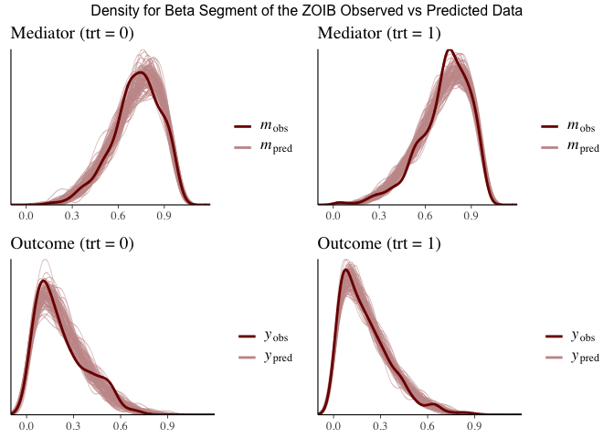
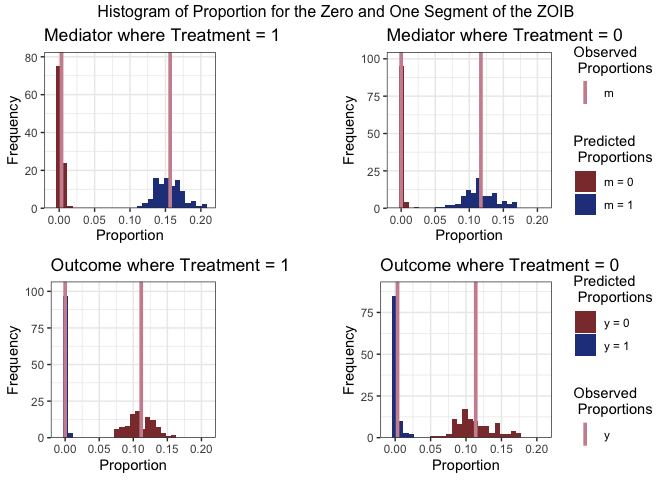

Causal Mediation Analysis: Bayesian Zero- and- One Inflated Beta in Stan
================
Lexi René


## Purpose

This code implements a Bayesian approach to causal mediation analysis,
using a zero-one inflated beta regression model in STAN. To illustrate
the method, the JOBS II data is used. This dataset can be found in the R
package
[`mediation`](https://cran.r-project.org/web/packages/mediation/index.html).
The JOBS II study was a randomized field experiment that investigated
the efficacy of a job training intervention on unemployed workers. In
this dataset there are 899 observations, containing no missing values.
The potential outcome variable, `depress2`, is a continuous measure of
depressive symptoms post-treatment (participation in job-skills
workshops). The mediator variable, `job_seek`, is a continuous measure
of job search self-efficacy. The treatment variable, `treat` is an
indicator variable for whether the participant was randomly selected for
the JOBS II training program.

## Pre-process data

For pre-processing of the data, the predictors are scaled using the R
function `scale`. The scaled matrices are designed to include a column
for the intercept. Both the mediator and the outcome variables are
scaled to be between 0 and 1.

``` r
library(rstan)
rstan_options(auto_write = TRUE)
library(mediation)
library(ggplot2)
library(tictoc)
library(bayesplot)
library(kableExtra)
library(ggpubr)
library(forcats)
require(reticulate)
# library(shinystan)
library(tidyr)
library(grid)


data(jobs); invisible(names(jobs))
num_seed = 1810201

## create data 
scaled_z <- scale(jobs[,c('econ_hard','sex','age')])
trt <- jobs$treat

## scale mediate and outcome
y <- normalize(jobs$depress2)
med <- normalize(jobs$job_seek)

qplot(y, geom = 'histogram', binwidth = .025, ylab = 'Frequency', xlab = 'Measure of Depression', fill=I('white'), col=I('blue')) + theme_bw() + theme(panel.grid.minor = element_blank())
```

<!-- -->

``` r
qplot(med, geom = 'histogram', binwidth = .025, ylab = 'Frequency', xlab = 'Measure of Confidence/Self- Efficacy in Job Search', fill=I('white'), col=I('blue')) + theme_bw() + theme(panel.grid.minor = element_blank())
```

<!-- -->

## Causal Mediation Analysis

### Potential/ Counterfactual Framework

Using the potential (counterfactual) outcome framework, the causal
effect of the job training program can be defined as the difference
between two potential outcomes. One potential outcome is realized if the
subject participates in the training program and the other potential
outcome is realized if the subject does not participate.

Suppose we use 
to represent the measure of depression for the

subject, , the
measure of confidence/self efficacy in the job search for the

subject, and ,
the binary indicator variable for the

subject’s treatment/participation in the JOBS II training program;
 takes on the
values of 
(participation in the training) or 
(otherwise). The depression level of subject
 is independent of
subject  (). In
addition, since the treatment in the JOBS II study is randomized,
 is statistically
independent of the potential outcomes; we can write this as
,Y_i(1) \\right) \\perp \\!\\!\\! \\perp{} A_i"). The
observed value for the depression level can be denoted by
, where , which can result in two potential values. For
example, ") would be the observed depression level for subject
, if subject
 actually participated
in the training program; in this case, the unobserved outcome for
subject  is the level of
depression if they did not participate in the training program. We will
use ")
to represent the potential level of depression that would result under
the treatment status 
for subject . In
addition, in causal mediation analysis, the potential outcome also
depends on the mediator. In the context of this study, this implies that
the level of job search self-efficacy can be affected by participation
in the program, which can be represented by
");
which also has two potential values
") and
").
The potential mediator value of subject
 are independent of the
treatment status for subject  (). Therefore, we will update the potential outcome to be
denoted as )") and also note that the potential outcome for subject
 is independent of both
the treatment status and the mediator value of subject
 ().

### Causal Mediation Effects

The statistical independence between the treatment assignment and the
potential outcome allows us to compute the average causal effect as the
observed mean difference between the treatment and control group:

<center>

  
![E\[Y\_i(1)-Y\_i(0)\] = E\[Y\_i(1)|A\_i = 1\] - E\[Y\_i(0)|A\_i = 0\]
\\quad (average \\;causal \\;
effect)](https://latex.codecogs.com/svg.latex?E%5BY_i%281%29-Y_i%280%29%5D%20%3D%20E%5BY_i%281%29%7CA_i%20%3D%201%5D%20-%20E%5BY_i%280%29%7CA_i%20%3D%200%5D%20%5Cquad%20%28average%20%5C%3Bcausal%20%5C%3B%20effect%29
"E[Y_i(1)-Y_i(0)] = E[Y_i(1)|A_i = 1] - E[Y_i(0)|A_i = 0] \\quad (average \\;causal \\; effect)")  

</center>

Under the counterfactual/potential outcome framework, only one potential
outcome of )") is observed, which we will denote by )"). Let  be a vector of baseline covariate for each subject
 and  be
the support of the distribution of
; in addition,
the support of 
is
. To identify the effects of treatment and mediation, we
assume sequential ignorability, as per Imai et al, by assuming the
following two statements of conditional independence hold:

<center>

  
, \\; M_i( a) \\Bigr \\} \\perp \\!\\!\\! \\perp{} A_i|Z_i=z \\qquad  (1) \\\\
Y_i( a', m) \\perp \\!\\!\\! \\perp{} M_i(a)|A_i = a,Z_i = z \\qquad (2)")  

</center>

where  \> 0") and  = m|A_i=a,Z_i=z) \> 0") for , and, all  and .

These ignorability assumptions are made sequentially. The first part of
the assumption assumes that given the observed confounders, prior to
treatment, the treatment  is ignorable. In terms of statistical
independence, the observed pre-treatment is independent of the potential
outcomes and potential mediators. The second part of sequential
ignorability states that the mediator is ignorable given the observed
treatment and pre-treatment confounders; meaning that the potential
outcome and mediator are unconfounded on the past observations and
confounders.

The indirect effect of the treatment on the outcome, through the
mediating variable is defined as the causal mediation effect (Imai et
al., 2010), for :

<center>

  
 \\equiv Y_i(a, M_i(1)) - Y_i(a, M_i(0))  \\\\ (causal \\; mediation/ natural\\; indirect \\; effect)")  

</center>

The following definitions are defined as the effect of the treatment
"), on the outcome, through the mediation variable:

The average causal mediation effect is defined by:

<center>

  
![\\qquad \\overline{\\delta}(a) \\equiv E\\left\[Y\_i(a, M\_i(1)) -
Y\_i(a, M\_i(0)\\right\] \\\\ &#10;(average \\; causal \\; mediation/
natural\\; indirect \\;
effect)](https://latex.codecogs.com/svg.latex?%5Cqquad%20%5Coverline%7B%5Cdelta%7D%28a%29%20%5Cequiv%20E%5Cleft%5BY_i%28a%2C%20M_i%281%29%29%20-%20Y_i%28a%2C%20M_i%280%29%5Cright%5D%20%20%5C%5C%20%0A%28average%20%5C%3B%20causal%20%5C%3B%20mediation%2F%20natural%5C%3B%20indirect%20%5C%3B%20effect%29
"\\qquad \\overline{\\delta}(a) \\equiv E\\left[Y_i(a, M_i(1)) - Y_i(a, M_i(0)\\right]  \\\\ 
(average \\; causal \\; mediation/ natural\\; indirect \\; effect)")  

</center>

The direct effect is defined by:

<center>

  
 \\equiv Y_i(1, M_i(a )) - Y_i(0, M_i(a ))  \\\\
\\qquad (natural\\; direct \\; effect)")  

</center>

The average direct effect is defined by:

<center>

  
![\\overline{\\zeta}(a) \\equiv E\\left\[Y\_i(1, M\_i(a)) - Y\_i(0,
M\_i(a))\\right\] \\\\ &#10;\\qquad (average\\; natural\\; direct \\;
effect)](https://latex.codecogs.com/svg.latex?%5Coverline%7B%5Czeta%7D%28a%29%20%5Cequiv%20E%5Cleft%5BY_i%281%2C%20M_i%28a%29%29%20-%20Y_i%280%2C%20M_i%28a%29%29%5Cright%5D%20%20%5C%5C%20%0A%5Cqquad%20%28average%5C%3B%20natural%5C%3B%20direct%20%5C%3B%20effect%29
"\\overline{\\zeta}(a) \\equiv E\\left[Y_i(1, M_i(a)) - Y_i(0, M_i(a))\\right]  \\\\ 
\\qquad (average\\; natural\\; direct \\; effect)")  

</center>

The total effect is defined by:

<center>

  
) - Y_i(0, M_i(0))  \\\\
\\qquad (total \\; effect)")  

</center>

Lastly, the average total effect is defined by:

<center>

  
![\\overline{\\tau} \\equiv E\\left\[Y\_i(1, M\_i(1)) - Y\_i(0, M\_i(0))
\\right\] \\\\ &#10;\\qquad (average \\; total \\;
effect)](https://latex.codecogs.com/svg.latex?%5Coverline%7B%5Ctau%7D%20%5Cequiv%20E%5Cleft%5BY_i%281%2C%20M_i%281%29%29%20-%20Y_i%280%2C%20M_i%280%29%29%20%5Cright%5D%20%20%5C%5C%20%0A%5Cqquad%20%28average%20%5C%3B%20total%20%5C%3B%20effect%29
"\\overline{\\tau} \\equiv E\\left[Y_i(1, M_i(1)) - Y_i(0, M_i(0)) \\right]  \\\\ 
\\qquad (average \\; total \\; effect)")  

</center>

Under the assumptions from
") and
"), Imai et
al. then showed that the distribution of the potential outcomes is
nonparametrically identified:

<center>

  
 = \\int_M f(Y_i|M_i = m, A_i = a, Z_i = z)dF_{M_i}(m|A_i=a',Z_i=z) \\quad x \\in X; \\; a,a' = 0,1 \\qquad (3) \\end{align*}")  

</center>

This result allows us to estimate the potential outcome and mediators
that we are unable to observe.

## Statistical Model

### Densities

The density of a random variable
 with a beta
distribution, where , can be re-parametrized (Ferrari & Cribari-Neto 2004) to
be defined as:

<center>

  
 = \\frac{\\Gamma(\\phi)}{\\Gamma(\\mu\\phi)\\Gamma((1-\\mu)\\phi)}r^{\\mu\\phi}(1-r)^{(1-\\mu)\\phi-1} \\quad(6)")  

</center>

<em>Note for "):
") denotes the gamma function, ![E\[R\] =
\\mu](https://latex.codecogs.com/svg.latex?E%5BR%5D%20%3D%20%5Cmu
"E[R] = \\mu"), and  = \\frac{\\mu(1-\\mu)}{\\phi+1}");
 is a
precision parameter, where for a fixed
, there is an
inverse relationship between
 and
").</em>

Using ") we
further assume the following regression models for both the response
variables, `depress2`, ,
and `job_seek`, , to
follow a zero-one inflated beta (ZOIB) distribution, as they lie within
the bounds \[0,1\]. The cumulative distribution function of the random
variable  under a ZOIB
distribution is:

here 
is the probability that the response is equal to zero,
 is
the probability that the response is equal to one, given the probability
that the response is not equal to zero,
 is the
expected value of the beta distribution,
 is the
precision of the beta distribution, and
 and
 are shape parameters;
 and  (Ferrari & Cribari-Neto 2004).

Ultimately, ) \\sim ZOIB(\\alpha_y^b, \\gamma_y^b, \\mu_y^b, \\phi_y^b)")
and  \\sim ZOIB(\\alpha_m^a, \\gamma_m^a, \\mu_m^a, \\phi_m^a)"), where
").The

moment for the density
") of
 and its’ variance can
be written as:

<center>

  
![\\qquad E\[R^{k}\] = (1-\\alpha)\\gamma +
(1-\\alpha)(1-\\gamma)\\mu\_k , \\quad k = 1,2,... \\qquad
(7.1)\\\\&#10;Var(R) = ((1-\\alpha)\\gamma)(1-((1-\\alpha)\\gamma)) +
(1-\\alpha)(1-\\gamma)\\left \[ \\frac{\\mu(1-\\mu)}{\\phi+1} +
\\mu^2-\\mu(1-\\alpha)(2\\gamma+\\mu(1-\\gamma)) \\right \] \\quad
(7.2)](https://latex.codecogs.com/svg.latex?%5Cqquad%20E%5BR%5E%7Bk%7D%5D%20%3D%20%281-%5Calpha%29%5Cgamma%20%2B%20%281-%5Calpha%29%281-%5Cgamma%29%5Cmu_k%20%2C%20%5Cquad%20k%20%3D%201%2C2%2C...%20%5Cqquad%20%287.1%29%5C%5C%0AVar%28R%29%20%3D%20%28%281-%5Calpha%29%5Cgamma%29%281-%28%281-%5Calpha%29%5Cgamma%29%29%20%2B%20%281-%5Calpha%29%281-%5Cgamma%29%5Cleft%20%5B%20%5Cfrac%7B%5Cmu%281-%5Cmu%29%7D%7B%5Cphi%2B1%7D%20%2B%20%5Cmu%5E2-%5Cmu%281-%5Calpha%29%282%5Cgamma%2B%5Cmu%281-%5Cgamma%29%29%20%5Cright%20%5D%20%5Cquad%20%287.2%29
"\\qquad E[R^{k}] = (1-\\alpha)\\gamma + (1-\\alpha)(1-\\gamma)\\mu_k , \\quad k = 1,2,... \\qquad (7.1)\\\\
Var(R) = ((1-\\alpha)\\gamma)(1-((1-\\alpha)\\gamma)) + (1-\\alpha)(1-\\gamma)\\left [ \\frac{\\mu(1-\\mu)}{\\phi+1} + \\mu^2-\\mu(1-\\alpha)(2\\gamma+\\mu(1-\\gamma)) \\right ] \\quad (7.2)")  

</center>

#### Bayesian approach to Causal Mediation Analysis

##### Bayesian Approach

For any random variable , where ") we assume

<center>

  
![\\begin{align\*}h^{-1}(\\alpha) = X\\beta\_{\\alpha} \\qquad
\\\\&#10;h^{-1}(\\gamma) = X\\beta\_{\\gamma} \\qquad
\\\\&#10;h^{-1}(\\mu) = X\\beta\_{\\mu} \\qquad \\\\&#10;exp(\\phi) =
X\\beta\_{\\phi} \\qquad \\\\&#10; \\\\&#10;\\beta\_{\[-1\]\\alpha}
\\sim MVN(0,\\Sigma\_{\\alpha}^{2}), \\\\&#10;\\beta\_{\[-1\]\\gamma}
\\sim MVN(0,\\Sigma\_{\\gamma}^{2}), \\\\&#10;\\beta\_{\[-1\]\\mu} \\sim
MVN(0,\\Sigma\_{\\mu}^{2}), \\\\&#10;\\beta\_{\[-1\]\\phi} \\sim
MVN(0,\\Sigma\_{\\phi}^{2})\\end{align\*}](https://latex.codecogs.com/svg.latex?%5Cbegin%7Balign%2A%7Dh%5E%7B-1%7D%28%5Calpha%29%20%3D%20X%5Cbeta_%7B%5Calpha%7D%20%5Cqquad%20%5C%5C%0Ah%5E%7B-1%7D%28%5Cgamma%29%20%3D%20X%5Cbeta_%7B%5Cgamma%7D%20%5Cqquad%20%5C%5C%0Ah%5E%7B-1%7D%28%5Cmu%29%20%3D%20X%5Cbeta_%7B%5Cmu%7D%20%5Cqquad%20%5C%5C%0Aexp%28%5Cphi%29%20%3D%20X%5Cbeta_%7B%5Cphi%7D%20%5Cqquad%20%5C%5C%0A%20%5C%5C%0A%5Cbeta_%7B%5B-1%5D%5Calpha%7D%20%5Csim%20MVN%280%2C%5CSigma_%7B%5Calpha%7D%5E%7B2%7D%29%2C%20%5C%5C%0A%5Cbeta_%7B%5B-1%5D%5Cgamma%7D%20%5Csim%20MVN%280%2C%5CSigma_%7B%5Cgamma%7D%5E%7B2%7D%29%2C%20%5C%5C%0A%5Cbeta_%7B%5B-1%5D%5Cmu%7D%20%5Csim%20MVN%280%2C%5CSigma_%7B%5Cmu%7D%5E%7B2%7D%29%2C%20%5C%5C%0A%5Cbeta_%7B%5B-1%5D%5Cphi%7D%20%5Csim%20MVN%280%2C%5CSigma_%7B%5Cphi%7D%5E%7B2%7D%29%5Cend%7Balign%2A%7D
"\\begin{align*}h^{-1}(\\alpha) = X\\beta_{\\alpha} \\qquad \\\\
h^{-1}(\\gamma) = X\\beta_{\\gamma} \\qquad \\\\
h^{-1}(\\mu) = X\\beta_{\\mu} \\qquad \\\\
exp(\\phi) = X\\beta_{\\phi} \\qquad \\\\
 \\\\
\\beta_{[-1]\\alpha} \\sim MVN(0,\\Sigma_{\\alpha}^{2}), \\\\
\\beta_{[-1]\\gamma} \\sim MVN(0,\\Sigma_{\\gamma}^{2}), \\\\
\\beta_{[-1]\\mu} \\sim MVN(0,\\Sigma_{\\mu}^{2}), \\\\
\\beta_{[-1]\\phi} \\sim MVN(0,\\Sigma_{\\phi}^{2})\\end{align*}")  

</center>

where the link function 
is a logit link function;
,
is the inverse of the link function that map values to a proportion
between 0 and 1. 
is the Multivariate Normal distribution, and
![\\beta\_{\[-1\]}](https://latex.codecogs.com/svg.latex?%5Cbeta_%7B%5B-1%5D%7D
"\\beta_{[-1]}") represents distribution of the

coefficients, excluding the intercept; the intercept of every

coefficient is assigned a uniform prior distribution.

For the mediator model, 
is a matrix containing the intercept, the baseline covariates,
, and the treatment
variable . For the
outcome model,  is a
matrix containing the intercept, the baseline covariates,
, the treatment variable
, and the mediator
variable  under a
specified treatment.

##### Algorithm

The steps above will be programmed in STAN.

## Store data and input in a list to send to STAN

The STAN model accepts the following values stored in a list:

  - n - the total number of observations
  - np - the total number of predictors,excluding the intercept and the
    treatment
  - sim - the total number of iterations per chain
  - y - the outcome variable scaled between 0 and 1; vector
  - m - the mediator variable scaled between 0 and 1; vector
  - a - the treatment variable; vector
  - z - the data matrix of scaled predictors
  - alpha\_cov\_m - the covariance for the normal prior set on alpha;
    used to model m
  - gamma\_cov\_m - the covariance for the normal prior set on gamma;
    used to model m
  - mu\_cov\_m - the covariance for the normal prior set on mu; used to
    model m
  - phi\_cov\_m - the covariance for the normal prior set on phi; used
    to model m
  - alpha\_cov\_y - the covariance for the normal prior set on alpha;
    used to model y
  - gamma\_cov\_y - the covariance for the normal prior set on gamma;
    used to model y
  - mu\_cov\_y - the covariance for the normal prior set on mu; used to
    model y
  - phi\_cov\_y - the covariance for the normal prior set on phi; used
    to model y

<!-- end list -->

``` r
jobs_data <-
  list(n = nrow(scaled_z),
       np = ncol(scaled_z),
       sim = 100*round(nrow(scaled_z),-2),
       y = y,
       m = med,
       a = trt,
       z = scaled_z,    
       ## cov_m: prior for coefficients of the mediator model; include treatment, do NOT include the intercept or mediator
       alpha_cov_m = diag(5, ncol(scaled_z)+1), ## == np + 1
       gamma_cov_m = diag(5, ncol(scaled_z)+1),
       mu_cov_m = diag(5, ncol(scaled_z)+1),
       phi_cov_m = diag(5, ncol(scaled_z)+1),
       ## cov_y: prior for coefficients of the outcome model; include the mediator and treatment, do not include the intercept
       alpha_cov_y = diag(5, ncol(scaled_z)+2),  ## == np + 2
       gamma_cov_y = diag(5, ncol(scaled_z)+2),
       mu_cov_y = diag(5, ncol(scaled_z)+2),
       phi_cov_y = diag(5, ncol(scaled_z)+2)
  )
```

## Stan Model

This model will return: \* coef\_mediator - alpha, gamma, mu, phi;
coefficients for the mediator model (1:iterations,1:np,1:4) \*
coef\_outcome - alpha, gamma, mu, phi; coefficients for the outcome
model (1:iterations,1:np+1,1:4) \* tau - total effect (length = total
iterations) \* delta - causal effect (1:iterations, 2) where \[a = 0, a
= 1\] \* zeta - direct effect (1:iterations, 2) where \[a = 0, a = 1\]

*Note: pred\_y has the columns to represent )").*

We can fit the model in Stan with the following code .

    ## functions{
    ##   matrix calc_zoib_par(matrix x_f,matrix coef_f){
    ##     vector[rows(x_f)] p_f;
    ##     vector[rows(x_f)] q_f;
    ##     matrix[rows(x_f), cols(coef_f)] x_theta;
    ##     matrix[rows(x_f), cols(coef_f)] params_hold;
    ##     matrix[rows(x_f), 2] new_alpha_gamma;
    ##     matrix[rows(x_f), 2] p_and_q;
    ##       
    ##     x_theta =  x_f * coef_f;   
    ##       x_theta[,1] = inv_logit(x_theta[,1]);
    ##       x_theta[,2] = inv_logit(x_theta[,2]);
    ##       x_theta[,3] = inv_logit(x_theta[,3]);
    ##       x_theta[,4] = exp(x_theta[,4]);
    ##     p_f = x_theta[,3] .* x_theta[,4];
    ##     q_f = x_theta[,4] - p_f;
    ##   
    ##     p_and_q = append_col(p_f,q_f);
    ##     new_alpha_gamma = append_col(x_theta[,1], x_theta[,2]);
    ##     params_hold = append_col(new_alpha_gamma, p_and_q); 
    ##   return params_hold ;
    ##   } 
    ## 
    ##   matrix calc_pred(matrix param_pred, int num_trt_splits){
    ##       matrix[(cols(param_pred)-num_trt_splits), rows(param_pred)] wt;
    ##       int sim = rows(param_pred);
    ##       int d = 1;
    ##       int i = 1;
    ##       
    ##       while( d < cols(param_pred)-3){
    ##         wt[d,] = to_row_vector(param_pred[,i]);
    ##         wt[d+1,] = to_row_vector((rep_vector(1,sim)-param_pred[,i]) .* param_pred[,i+1]);
    ##         wt[d+2,] = to_row_vector((rep_vector(1,sim)-param_pred[,i]) .* (rep_vector(1,sim)-param_pred[,i+1]));
    ##         d += 3;
    ##         i += 4;
    ##       }
    ##   return wt;
    ##   } 
    ## } 
    ## data{
    ##   int n;
    ##   int np; // number of parameters excluding intercept and treatment
    ##   int sim;
    ##   vector<lower=0, upper=1>[n] y;
    ##   vector<lower=0, upper=1>[n] m;
    ##   vector[n] a; //treatment variable
    ##   matrix[n, np] z;
    ##   matrix[np+1, np+1] alpha_cov_m;
    ##   matrix[np+1, np+1] gamma_cov_m;
    ##   matrix[np+1, np+1] mu_cov_m;
    ##   matrix[np+1, np+1] phi_cov_m;
    ##   matrix[np+2, np+2] alpha_cov_y;
    ##   matrix[np+2, np+2] gamma_cov_y;
    ##   matrix[np+2, np+2] mu_cov_y;
    ##   matrix[np+2, np+2] phi_cov_y;
    ## }
    ## transformed data{
    ##   matrix[n, np+2] x; //ncol(z), trt, int
    ##   matrix[n, np+3] x_out;
    ##   x = append_col(append_col(rep_vector(1,n),z), a); //insert col for intercept of 1s
    ##   x_out = append_col(x, m);
    ## }
    ## parameters{
    ##   matrix[np+2, 4] coef_mediator;
    ##   matrix[np+3, 4] coef_outcome;
    ## }
    ## model{
    ##   matrix[n, 4] all_params_m;
    ##   matrix[n, 4] all_params_y;
    ##   all_params_m = calc_zoib_par(x, coef_mediator);
    ##   all_params_y = calc_zoib_par(x_out, coef_outcome);
    ##   
    ##   // coefficients for mediator model; does not include the mediator
    ##   coef_mediator[2:,1] ~ multi_normal(rep_vector(0,cols(x)-1), alpha_cov_m);
    ##   coef_mediator[2:,2] ~ multi_normal(rep_vector(0,cols(x)-1), gamma_cov_m);
    ##   coef_mediator[2:,3] ~ multi_normal(rep_vector(0,cols(x)-1), mu_cov_m);
    ##   coef_mediator[2:,4] ~ multi_normal(rep_vector(0,cols(x)-1), phi_cov_m);
    ##   
    ##   // coefficients for outcome model; includes the mediator
    ##   coef_outcome[2:,1] ~ multi_normal(rep_vector(0,cols(x_out)-1), alpha_cov_y);
    ##   coef_outcome[2:,2] ~ multi_normal(rep_vector(0,cols(x_out)-1), gamma_cov_y);
    ##   coef_outcome[2:,3] ~ multi_normal(rep_vector(0,cols(x_out)-1), mu_cov_y);
    ##   coef_outcome[2:,4] ~ multi_normal(rep_vector(0,cols(x_out)-1), phi_cov_y);
    ## 
    ##   // zero one inflated beta likelihood
    ##     for (i in 1:n) {
    ##       if (y[i] == 0) {
    ##         target += log(all_params_y[i,1]) ;
    ##       } else if (y[i] == 1) {
    ##         target += log1m(all_params_y[i,1]) + log(all_params_y[i,2]);
    ##       } else {
    ##         target += log1m(all_params_y[i,1]) + log1m(all_params_y[i,2]) + beta_lpdf(y[i] | all_params_y[i,3], all_params_y[i,4]);
    ##       }
    ##     
    ##       if (m[i] == 0) {
    ##         target += log(all_params_m[i,1]);
    ##       } else if (m[i] == 1) {
    ##         target += log1m(all_params_m[i,1]) + log(all_params_m[i,2]);
    ##       } else {
    ##         target += log1m(all_params_m[i,1]) + log1m(all_params_m[i,2]) + beta_lpdf(m[i] | all_params_m[i,3], all_params_m[i,4]);
    ##       }
    ##     }
    ## }
    ## generated quantities{
    ##   real tau;
    ##   vector[2] delta;
    ##   vector[2] zeta;
    ##   {
    ##     int index;
    ##     matrix[sim, 2] pred_m;
    ##     matrix[sim, 4] pred_y;
    ##     matrix[sim, 16] param_pred_y;
    ##     matrix[sim, 8] param_pred_m;
    ##     vector[rows(z)] wt;
    ##     matrix[6, sim] wt_m; //  piecewise density: three possible outcomes for density per trt
    ##     matrix[12, sim] wt_y;
    ##     matrix[sim, np+2] X_sample;
    ##     matrix[sim, np+2] X_m0;
    ##     matrix[sim, np+2] X_m1;
    ##     matrix[sim, np+3] X_y0_m0;
    ##     matrix[sim, np+3] X_y0_m1;
    ##     matrix[sim, np+3] X_y1_m0;
    ##     matrix[sim, np+3] X_y1_m1;
    ##     
    ##       wt = dirichlet_rng(rep_vector(1, rows(z))); 
    ##       for (j in 1:sim){
    ##         index = categorical_rng(wt);
    ##         X_sample[j,:] = x[index,:];
    ##       }
    ## 
    ##       // assign treatment values for each sample
    ##       X_m0 = X_sample;
    ##       X_m0[:,cols(x)] = rep_vector(0, sim); // cols(x) == index for last col of x, which is treat
    ## 
    ##       X_m1 = X_sample;
    ##       X_m1[:,cols(x)] = rep_vector(1, sim);
    ##       
    ##       // calculate new alpha, gamma, mu, phi
    ##       param_pred_m[,1:4] = calc_zoib_par(X_m0, coef_mediator);
    ##       param_pred_m[,5:8] = calc_zoib_par(X_m1, coef_mediator);
    ##     
    ##       wt_m = calc_pred(param_pred_m, 2);
    ## 
    ##       for(k in 1:sim){
    ##         int index_wtm0 = categorical_rng(wt_m[1:3,k]);
    ##         int index_wtm1 = categorical_rng(wt_m[4:6,k]);
    ##         
    ##         if (index_wtm0 == 1){ pred_m[k,1] = 0;}
    ##           else if (index_wtm0 == 2){pred_m[k,1] = 1;}
    ##             else if (index_wtm0 == 3){pred_m[k,1] = beta_rng(param_pred_m[k,3],param_pred_m[k,4]);}
    ##             
    ##         if (index_wtm1 == 1){ pred_m[k,2] = 0;}
    ##           else if (index_wtm1 == 2){pred_m[k,2] = 1;}
    ##             else if (index_wtm1 == 3){pred_m[k,2] = beta_rng(param_pred_m[k,7],param_pred_m[k,8]);}
    ##       }
    ##       
    ##       X_y0_m0 = append_col(X_m0, pred_m[,1]);
    ##       X_y0_m1 = append_col(X_m0, pred_m[,2]);
    ##       X_y1_m1 = append_col(X_m1, pred_m[,2]);
    ##       X_y1_m0 = append_col(X_m1, pred_m[,1]);
    ##       
    ##       //coef_mediator is np+2 x 4. it includes the mediator
    ##       param_pred_y[,1:4] = calc_zoib_par(X_y0_m0, coef_outcome);
    ##       param_pred_y[,5:8] = calc_zoib_par(X_y0_m1, coef_outcome);
    ##       param_pred_y[,9:12] = calc_zoib_par(X_y1_m1, coef_outcome);
    ##       param_pred_y[,13:16] = calc_zoib_par(X_y1_m0, coef_outcome);
    ##       
    ##       wt_y = calc_pred(param_pred_y, 4);
    ##       
    ##       for(h in 1:sim){
    ##           int index_y0m0 = categorical_rng(wt_y[1:3,h]);
    ##           int index_y0m1 = categorical_rng(wt_y[4:6,h]);
    ##           int index_y1m1 = categorical_rng(wt_y[7:9,h]);
    ##           int index_y1m0 = categorical_rng(wt_y[10:12,h]);
    ## 
    ##           if (index_y0m0 == 1){pred_y[h,1] = 0;}
    ##           else if (index_y0m0 == 2){pred_y[h,1] = 1;}
    ##           else if (index_y0m0 == 3){pred_y[h,1] = beta_rng(param_pred_y[h,3],param_pred_y[h,4]);}
    ## 
    ##           if (index_y0m1 == 1){ pred_y[h,2] = 0;}
    ##           else if (index_y0m1 == 2){pred_y[h,2] = 1;}
    ##           else if (index_y0m1 == 3){pred_y[h,2] = beta_rng(param_pred_y[h,7],param_pred_y[h,8]);}
    ## 
    ##           if (index_y1m1 == 1){ pred_y[h,3] = 0;}
    ##           else if (index_y1m1 == 2){pred_y[h,3] = 1;}
    ##           else if (index_y1m1 == 3){pred_y[h,3] = beta_rng(param_pred_y[h,11],param_pred_y[h,12]);}
    ## 
    ##           if (index_y1m0 == 1){ pred_y[h,4] = 0;}
    ##           else if (index_y1m0 == 2){pred_y[h,4] = 1;}
    ##           else if (index_y1m0 == 3){pred_y[h,4] = beta_rng(param_pred_y[h,15],param_pred_y[h,16]);}
    ##       }
    ##       
    ##       delta[1] = mean(pred_y[:,2]) - mean(pred_y[:,1]);
    ##       delta[2] = mean(pred_y[:,3]) - mean(pred_y[:,4]);
    ##       zeta[1] = mean(pred_y[:,4]) - mean(pred_y[:,1]);
    ##       zeta[2] = mean(pred_y[:,3]) - mean(pred_y[:,2]);
    ##       tau = mean(pred_y[:,3]) - mean(pred_y[:,1]);
    ## 
    ##   }  // end of local variables
    ## }  //end of generated quantities

    ## $coef_mediator
    ## [1] 4000    5    4
    ## 
    ## $coef_outcome
    ## [1] 4000    6    4
    ## 
    ## $tau
    ## [1] 4000
    ## 
    ## $delta
    ## [1] 4000    2
    ## 
    ## $zeta
    ## [1] 4000    2
    ## 
    ## $lp__
    ## [1] 4000

## Assessing STAN output

When assessing STAN output, one of the things that you want to check is
whether the chains are converging, and that they are converging to the
same area. Some of the recommended convergence checks include monitoring
the potential scale reduction (PSR) factor,  statistic,
and using visual checks, e.g. traceplots.  evaluates
the mixing of the chains by comparing the variation between the chains
to the variation within the chains. “The condition of  being
‘near’ 1 depends on the problem at hand, but we generally have been
satisfied with setting 1.1 as a threshold” (Gelman et al., 2004).

Additionally, since the Markov Chain Monte Carlo (MCMC) does not return
independent draws, the simulations within each chain will show some
level of autocorrelation. This autocorrelation increases the uncertainty
of the estimation of posterior quantities. The amount by which this
autocorrelation increases in estimates can be measured by the effective
sample size (ESS),
,
which should be large so that it can provide a measure of precision;

is the ‘effective number of independent simulation draws’.  
<!-- ### Assess Rhat and Effective Sample Size -->

<table class="table table-striped table-hover" style="margin-left: auto; margin-right: auto;">

<caption>

Assessing the Markov Chain Monte Carlo

</caption>

<thead>

<tr>

<th style="text-align:left;">

</th>

<th style="text-align:left;">

Min.

</th>

<th style="text-align:left;">

1st Qu.

</th>

<th style="text-align:left;">

Median

</th>

<th style="text-align:left;">

Mean

</th>

<th style="text-align:left;">

3rd Qu.

</th>

<th style="text-align:left;">

Max.

</th>

</tr>

</thead>

<tbody>

<tr>

<td style="text-align:left;">

R̂

</td>

<td style="text-align:left;">

0.9992

</td>

<td style="text-align:left;">

0.9995

</td>

<td style="text-align:left;">

0.9999

</td>

<td style="text-align:left;">

1.0000

</td>

<td style="text-align:left;">

1.0003

</td>

<td style="text-align:left;">

1.0027

</td>

</tr>

<tr>

<td style="text-align:left;">


</td>

<td style="text-align:left;">

1868

</td>

<td style="text-align:left;">

2812

</td>

<td style="text-align:left;">

4272

</td>

<td style="text-align:left;">

3896

</td>

<td style="text-align:left;">

4599

</td>

<td style="text-align:left;">

6478

</td>

</tr>

</tbody>

</table>

<table class="table table-striped table-hover" style="margin-left: auto; margin-right: auto;">

<caption>

Bayesian and Frequentist Estimated Effects Results

</caption>

<thead>

<tr>

<th style="text-align:center;">

Estimated Causal Effects

</th>

<th style="text-align:center;">

Effect

</th>

<th style="text-align:center;">

Est.

</th>

<th style="text-align:center;">

SD

</th>

<th style="text-align:center;">

Z-Score

</th>

<th style="text-align:center;">

p-value

</th>

<th style="text-align:center;">

95% LCI

</th>

<th style="text-align:center;">

95% UCI

</th>

</tr>

</thead>

<tbody>

<tr>

<td style="text-align:center;font-weight: bold;vertical-align: middle !important;" rowspan="5">

Bayesian

</td>

<td style="text-align:center;">

δ̅(0)

</td>

<td style="text-align:center;">

\-0.0129

</td>

<td style="text-align:center;">

0.0157

</td>

<td style="text-align:center;">

\-0.8173

</td>

<td style="text-align:center;">

0.4138

</td>

<td style="text-align:center;">

\-0.0449

</td>

<td style="text-align:center;">

0.0173

</td>

</tr>

<tr>

<td style="text-align:center;">

δ̅(1)

</td>

<td style="text-align:center;">

\-0.0119

</td>

<td style="text-align:center;">

0.0150

</td>

<td style="text-align:center;">

\-0.7944

</td>

<td style="text-align:center;">

0.4270

</td>

<td style="text-align:center;">

\-0.0416

</td>

<td style="text-align:center;">

0.0169

</td>

</tr>

<tr>

<td style="text-align:center;">

ζ̅(0)

</td>

<td style="text-align:center;">

\-0.0342

</td>

<td style="text-align:center;">

0.0442

</td>

<td style="text-align:center;">

\-0.7737

</td>

<td style="text-align:center;">

0.4391

</td>

<td style="text-align:center;">

\-0.1226

</td>

<td style="text-align:center;">

0.0503

</td>

</tr>

<tr>

<td style="text-align:center;">

ζ̅(1)

</td>

<td style="text-align:center;">

\-0.0333

</td>

<td style="text-align:center;">

0.0439

</td>

<td style="text-align:center;">

\-0.7570

</td>

<td style="text-align:center;">

0.4490

</td>

<td style="text-align:center;">

\-0.1202

</td>

<td style="text-align:center;">

0.0513

</td>

</tr>

<tr>

<td style="text-align:center;">

τ̅

</td>

<td style="text-align:center;">

\-0.0461

</td>

<td style="text-align:center;">

0.0460

</td>

<td style="text-align:center;">

\-1.0024

</td>

<td style="text-align:center;">

0.3161

</td>

<td style="text-align:center;">

\-0.1387

</td>

<td style="text-align:center;">

0.0413

</td>

</tr>

<tr>

<td style="text-align:center;font-weight: bold;vertical-align: middle !important;" rowspan="3">

Frequentist

</td>

<td style="text-align:center;">

δ̅

</td>

<td style="text-align:center;">

\-0.0157

</td>

<td style="text-align:center;">

0.0117

</td>

<td style="text-align:center;">

\-1.3400

</td>

<td style="text-align:center;">

0.1800

</td>

<td style="text-align:center;">

\-0.0411

</td>

<td style="text-align:center;">

0.0074

</td>

</tr>

<tr>

<td style="text-align:center;">

ζ̅

</td>

<td style="text-align:center;">

\-0.0403

</td>

<td style="text-align:center;">

0.0483

</td>

<td style="text-align:center;">

\-0.8300

</td>

<td style="text-align:center;">

0.4040

</td>

<td style="text-align:center;">

\-0.1191

</td>

<td style="text-align:center;">

0.0539

</td>

</tr>

<tr>

<td style="text-align:center;">

τ̅

</td>

<td style="text-align:center;">

\-0.0560

</td>

<td style="text-align:center;">

0.0472

</td>

<td style="text-align:center;">

\-1.1900

</td>

<td style="text-align:center;">

0.2360

</td>

<td style="text-align:center;">

\-0.1347

</td>

<td style="text-align:center;">

0.0406

</td>

</tr>

</tbody>

</table>

<!-- ### Assess Traceplots -->

<!-- -->

<!-- --><!-- --><!-- -->

<!-- ## Summarizing the Posteriors -->


<!-- -->

<!-- -->

<!-- -->
<br />

##### References

  - Ferrari, S., and Cribari-Neto, F. (2004). “Beta regression for
    modelling rates and proportions,” Journal of Applied Statistics,
    31(7), 799-815
  - Gelman, A., Carlin, J.B., Stern, H.S., and Rubin, D.B. (2004).
    Bayesian data analysis (2nd ed.)
  - Imai, K., Keele, L., and Tingley, D. (2010),“A General Approach to
    Causal Mediation Analysis,”Psychological Methods, 15(4), 309–334
