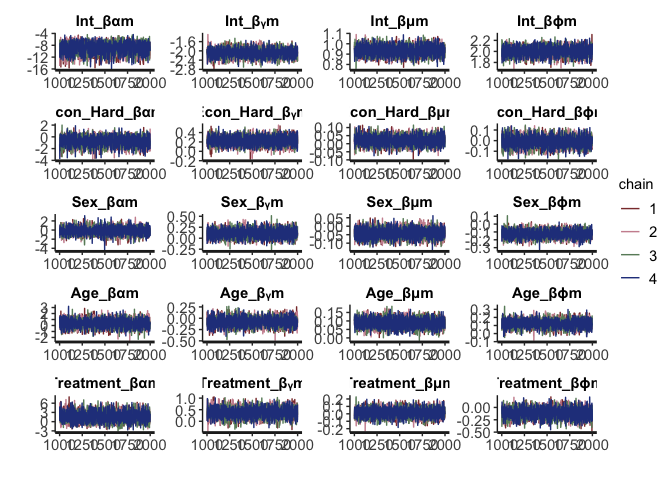

Bayesian Zero- and- One Inflated Beta Regression in Stan with Causal
Mediation
================
Lexi Rene

<style type="text/css">
pre, code {white-space:pre !important; overflow-y:auto}
</style>

## Purpose

This code implements a Bayesian approach to causal mediation analysis,
using a zero-one inflated beta regression model in STAN. To illustrate
the method, the JOBS II data is used. This dataset can be found in the R
package
[`mediation`](https://cran.r-project.org/web/packages/mediation/index.html).
The JOBS II study was a randomized field experiment that investigated
the efficacy of a job training intervention on unemployed workers. In
this dataset there are 899 observations, containing no missing values.
The potential outcome variable, `depress2`, is a continuous measure of
depressive symptoms post-treatment (participation in job-skills
workshops). The mediator variable, `job_seek`, is a continuous measure
of job search self-efficacy. The treatment variable, `treat` is an
indicator variable for whether the participant was randomly selected for
the JOBS II training program.

## Pre-process data

For pre-processing of the data, the predictors are scaled using the R
function `scale`. The scaled matrices are designed to include a column
for the intercept. Both the mediator and the outcome variables are
scaled to be between 0 and 1.

``` r
library(rstan)
rstan_options(auto_write = TRUE)
library(mediation)
library(ggplot2)
library(tictoc)
library(bayesplot)
library(kableExtra)
library(ggpubr)
# library(shinystan)

data(jobs); invisible(names(jobs))

normalize <- function(x){ 
  return((x- min(x)) /(max(x)-min(x)))
}
round_df <- function(x, digits) {
    # round all numeric variables
    # x: data frame 
    # digits: number of digits to round
    numeric_columns <- sapply(x, class) == 'numeric'
    x[numeric_columns] <-  round(x[numeric_columns], digits)
    x
}
num_seed = 1810201

## create data 
scaled_z <- scale(jobs[,c('econ_hard','sex','age')])
trt <- jobs$treat

## scale mediate and outcome
y <- normalize(jobs$depress2)
med <- normalize(jobs$job_seek)

qplot(y, geom = 'histogram', binwidth = .025, ylab = 'Frequency', xlab = 'Measure of Depression', fill=I('white'), col=I('blue')) + theme_bw() + theme(panel.grid.minor = element_blank())
```

<!-- -->

``` r
qplot(med, geom = 'histogram', binwidth = .025, ylab = 'Frequency', xlab = 'Measure of Confidence/Self- Efficacy in Job Search', fill=I('white'), col=I('blue')) + theme_bw() + theme(panel.grid.minor = element_blank())
```

<!-- -->

## Causal Mediation Analysis

### Potential/ Counterfactual Framework

Using the potential (counterfactual) outcome framework, the causal
effect of the job training program can be defined as the difference
between two potential outcomes. One potential outcome is realized if the
subject participates in the training program and the other potential
outcome is realized if the subject does not participate.

Suppose we use 
to represent the measure of depression for the

subject, , the
measure of confidence/self efficacy in the job search for the

subject, and ,
the binary indicator variable for the

subject’s treatment/participation in the JOBS II training program;
 takes on the
values of 
(participation in the training) or 
(otherwise). The depression level of subject
 is independent of
subject  (). In
addition, since the treatment in the JOBS II study is randomized,
 is statistically
independent of the potential outcomes; we can write this as
 \\perp \\!\\!\\! \\perp{} A_i").
The observed value for the depression level can be denoted by
, where , which can result in two potential values. For
example,
 would be the observed depression level for subject
, if subject
 actually participated
in the training program; in this case, the unobserved outcome for
subject  is the level of
depression if they did not participate in the training program. We will
use  to represent the potential level of depression that
would result under the treatment status
 for subject
. In addition, in causal
mediation analysis, the potential outcome also depends on the mediator.
In the context of this study, this implies that the level of job search
self-efficacy can be affected by participation in the program, which can
be represented by
; which also has two potential values
 and
. The potential mediator value of subject
 are independent of the
treatment status for subject  (). Therefore, we will update the potential outcome to be
denoted as  and also note that the potential outcome for
subject  is independent
of both the treatment status and the mediator value of subject
 ().

### Causal Mediation Effects

The statistical independence between the treatment and the potential
outcome allows us to compute the average causal effect as the observed
mean difference between the treatment and control group:

<center>

  
![E\[Y\_i^{A\_i=1}-Y\_i^{A\_i=0}\] = E\[Y\_i^{A\_i=1}|A\_i = 1\] -
E\[Y\_i^{A\_i=0}|A\_i = 0\] \\quad (average \\;causal \\;
effect)](https://latex.codecogs.com/svg.latex?E%5BY_i%5E%7BA_i%3D1%7D-Y_i%5E%7BA_i%3D0%7D%5D%20%3D%20E%5BY_i%5E%7BA_i%3D1%7D%7CA_i%20%3D%201%5D%20-%20E%5BY_i%5E%7BA_i%3D0%7D%7CA_i%20%3D%200%5D%20%5Cquad%20%28average%20%5C%3Bcausal%20%5C%3B%20effect%29
"E[Y_i^{A_i=1}-Y_i^{A_i=0}] = E[Y_i^{A_i=1}|A_i = 1] - E[Y_i^{A_i=0}|A_i = 0] \\quad (average \\;causal \\; effect)")  

</center>

Under the counterfactual/potential outcome framework, only one potential
outcome of  is observed. Let
 be a vector of
baseline covariate for each subject
 and  be
the support of the distribution of
; in addition,
the support of 
is
. To identify the effects of treatment and mediation, we
assume sequential ignorability, as per Imai et al, by assuming the
following two statements of conditional independence hold: <br />

<center>

  
 \\\\
Y_i^{A_i=a', m = M_i^{A_i=a'}} \\perp \\!\\!\\! \\perp{} M_i|A_i,Z_i = z \\qquad (2)")  

</center>

where  \> 0") and  \> 0") for , and, all  and .

These ignorability assumptions are made sequentially. The first part of
the assumption assumes that given the observed confounders, prior to
treatment, the treatment assignment is ignorable. In terms of
statistical independence, the observed pre-treatment is independent of
the potential outcomes and potential mediators. The second part of
sequential ignorability states that the mediator is ignorable given the
observed treatment and pre-treatment confounders; meaning that the
potential outcome and mediator are unconfounded on the past observations
and confounders.

The indirect effect of the treatment on the outcome, through the
mediating variable is defined as the causal mediation effect (Imai et
al., 2010), for :

<center>

  
")  

</center>

The following definitions are defined as the effect of the treatment
"), on the outcome, through the mediation variable:

The average causal mediation effect is defined by:

<center>

  
![\\qquad \\overline{\\delta^{A=a}} \\equiv E\\left\[Y\_i^{A\_i=a,
M\_i^{A\_i=1 }} - Y\_i^{A\_i=a, M\_i^{A\_i=0 }}\\right\] \\\\
&#10;(average \\; causal \\; mediation/ natural\\; indirect \\;
effect)](https://latex.codecogs.com/svg.latex?%5Cqquad%20%5Coverline%7B%5Cdelta%5E%7BA%3Da%7D%7D%20%5Cequiv%20E%5Cleft%5BY_i%5E%7BA_i%3Da%2C%20M_i%5E%7BA_i%3D1%20%7D%7D%20-%20Y_i%5E%7BA_i%3Da%2C%20M_i%5E%7BA_i%3D0%20%7D%7D%5Cright%5D%20%20%5C%5C%20%0A%28average%20%5C%3B%20causal%20%5C%3B%20mediation%2F%20natural%5C%3B%20indirect%20%5C%3B%20effect%29
"\\qquad \\overline{\\delta^{A=a}} \\equiv E\\left[Y_i^{A_i=a, M_i^{A_i=1 }} - Y_i^{A_i=a, M_i^{A_i=0 }}\\right]  \\\\ 
(average \\; causal \\; mediation/ natural\\; indirect \\; effect)")  

</center>

The direct effect is defined by:

<center>

  
")  

</center>

The average direct effect is defined by:

<center>

  
![\\overline{\\zeta^{A=a}} \\equiv E\\left\[Y\_i^{A\_i=1, M\_i^{A\_i=a
}} - Y\_i^{A\_i=0, M\_i^{A\_i=a }}\\right\] \\\\ &#10;\\qquad
(average\\; natural\\; direct \\;
effect)](https://latex.codecogs.com/svg.latex?%5Coverline%7B%5Czeta%5E%7BA%3Da%7D%7D%20%5Cequiv%20E%5Cleft%5BY_i%5E%7BA_i%3D1%2C%20M_i%5E%7BA_i%3Da%20%7D%7D%20-%20Y_i%5E%7BA_i%3D0%2C%20M_i%5E%7BA_i%3Da%20%7D%7D%5Cright%5D%20%20%5C%5C%20%0A%5Cqquad%20%28average%5C%3B%20natural%5C%3B%20direct%20%5C%3B%20effect%29
"\\overline{\\zeta^{A=a}} \\equiv E\\left[Y_i^{A_i=1, M_i^{A_i=a }} - Y_i^{A_i=0, M_i^{A_i=a }}\\right]  \\\\ 
\\qquad (average\\; natural\\; direct \\; effect)")  

</center>

The total effect is defined by:

<center>

  
")  

</center>

Lastly, the average total effect is defined by:

<center>

  
![\\overline{\\tau} \\equiv E\\left\[Y\_i^{A\_i=1, M\_i^{A\_i=1 }} -
Y\_i^{A\_i=0, M\_i^{A\_i=0 }}\\right\] \\\\ &#10;\\qquad (average \\;
total \\;
effect)](https://latex.codecogs.com/svg.latex?%5Coverline%7B%5Ctau%7D%20%5Cequiv%20E%5Cleft%5BY_i%5E%7BA_i%3D1%2C%20M_i%5E%7BA_i%3D1%20%7D%7D%20-%20Y_i%5E%7BA_i%3D0%2C%20M_i%5E%7BA_i%3D0%20%7D%7D%5Cright%5D%20%20%5C%5C%20%0A%5Cqquad%20%28average%20%5C%3B%20total%20%5C%3B%20effect%29
"\\overline{\\tau} \\equiv E\\left[Y_i^{A_i=1, M_i^{A_i=1 }} - Y_i^{A_i=0, M_i^{A_i=0 }}\\right]  \\\\ 
\\qquad (average \\; total \\; effect)")  

</center>

Under the assumptions from
") and
"), Imai et
al. then showed that the distribution of the potential outcomes is
nonparametrically identified:

<center>

  
 = \\int_M f(Y_i|M_i = m, A_i = a, Z_i = z)dF_{M_i}(m|A_i=a',Z_i=z) \\quad x \\in X; \\; a,a' = 0,1 \\qquad (3) \\end{align*}")  

</center>

This result allows us to estimate the potential outcome and mediators
that we are unable to observe.

## Statistical Model

#### Densities

The density of a random variable
 with a beta
distribution, where , can be reparametrized (Ferrari & Cribari-Neto 2004) to
be defined as:

<center>

  
 = \\frac{\\Gamma(\\phi)}{\\Gamma(\\mu\\phi)\\Gamma((1-\\mu)\\phi)}r^{\\mu\\phi}(1-r)^{(1-\\mu)\\phi-1} \\quad(6)")  

</center>

<em> Note for "):
") denotes the gamma function, ![E\[R\] =
\\mu](https://latex.codecogs.com/svg.latex?E%5BR%5D%20%3D%20%5Cmu
"E[R] = \\mu"), and  = \\frac{\\mu(1-\\mu)}{\\phi+1}");
 is a
precision parameter, where for a fixed
, there is an
inverse relationship between
 and
").</em>

Using ") we
further assume the following regression models for both the response
variables, `depress2`, ,
and `job_seek`, , to
follow a zero-one inflated beta (ZOIB) distribution, as they lie within
the bounds \[0,1\]. The cumulative distribution function of the random
variable  under a ZOIB
distribution is:

<center>

 = \\alpha \\; \\text{I}(r=0) + (1-\\alpha)\\gamma \\; \\text{I}(r = 1) + (1-\\alpha)(1-\\gamma)F_{beta}(R;\\mu,\\phi) \\end{align*}")

</center>

Where the density of ,is
defined as:

<center>

  
 =
  \\begin{cases}
        \\alpha & \\text{if } r_i = 0 \\\\
        (1-\\alpha)\\gamma & \\text{if  } r_i = 1 \\\\
        (1-\\alpha)(1-\\gamma)f_{beta}(r_i;\\mu_{i},\\phi_{i}) & \\text{if  }r_i \\in \\text{(0,1)} \\\\
  \\end{cases}
  \\quad (7)")  

 \\sim Beta(p= \\mu\\phi,\\: q= \\phi(1-\\mu))}")

</center>

here 
is the probability that the response is equal to zero,
 is
the probability that the response is equal to one, given the probability
that the response is not equal to zero,
 is the
expected value of the beta distribution,
 is the
precision of the beta distribution, and
 and
 are shape parameters;
 and  (Ferrari & Cribari-Neto 2004). Ultimately, ") and ").

The  moment for the density
") of
 and its’ variance can
be written as:

<center>

  
![\\qquad E\[R^{k}\] = (1-\\alpha)\\gamma +
(1-\\alpha)(1-\\gamma)\\mu\_k , \\quad k = 1,2,... \\qquad
(7.1)\\\\&#10;Var(R) = ((1-\\alpha)\\gamma)(1-((1-\\alpha)\\gamma)) +
(1-\\alpha)(1-\\gamma)\\left \[ \\frac{\\mu(1-\\mu)}{\\phi+1} +
\\mu^2-\\mu(1-\\alpha)(2\\gamma+\\mu(1-\\gamma)) \\right \] \\quad
(7.2)](https://latex.codecogs.com/svg.latex?%5Cqquad%20E%5BR%5E%7Bk%7D%5D%20%3D%20%281-%5Calpha%29%5Cgamma%20%2B%20%281-%5Calpha%29%281-%5Cgamma%29%5Cmu_k%20%2C%20%5Cquad%20k%20%3D%201%2C2%2C...%20%5Cqquad%20%287.1%29%5C%5C%0AVar%28R%29%20%3D%20%28%281-%5Calpha%29%5Cgamma%29%281-%28%281-%5Calpha%29%5Cgamma%29%29%20%2B%20%281-%5Calpha%29%281-%5Cgamma%29%5Cleft%20%5B%20%5Cfrac%7B%5Cmu%281-%5Cmu%29%7D%7B%5Cphi%2B1%7D%20%2B%20%5Cmu%5E2-%5Cmu%281-%5Calpha%29%282%5Cgamma%2B%5Cmu%281-%5Cgamma%29%29%20%5Cright%20%5D%20%5Cquad%20%287.2%29
"\\qquad E[R^{k}] = (1-\\alpha)\\gamma + (1-\\alpha)(1-\\gamma)\\mu_k , \\quad k = 1,2,... \\qquad (7.1)\\\\
Var(R) = ((1-\\alpha)\\gamma)(1-((1-\\alpha)\\gamma)) + (1-\\alpha)(1-\\gamma)\\left [ \\frac{\\mu(1-\\mu)}{\\phi+1} + \\mu^2-\\mu(1-\\alpha)(2\\gamma+\\mu(1-\\gamma)) \\right ] \\quad (7.2)")  

</center>

#### Bayesian approach to Causal Mediation Analysis

##### Bayesian Approach

") where we assume

<center>

  
![\\begin{align\*}h^{-1}(\\alpha) = X\\beta\_{\\alpha} \\qquad
\\\\&#10;h^{-1}(\\gamma) = X\\beta\_{\\gamma} \\qquad
\\\\&#10;h^{-1}(\\mu) = X\\beta\_{\\mu} \\qquad \\\\&#10;exp(\\phi) =
X\\beta\_{\\phi} \\qquad \\\\&#10; \\\\&#10;\\beta\_{\[-1\]\\alpha}
\\sim MVN(0,\\Sigma\_{\\alpha}^{2}), \\\\&#10;\\beta\_{\[-1\]\\gamma}
\\sim MVN(0,\\Sigma\_{\\gamma}^{2}), \\\\&#10;\\beta\_{\[-1\]\\mu} \\sim
MVN(0,\\Sigma\_{\\mu}^{2}), \\\\&#10;\\beta\_{\[-1\]\\phi} \\sim
MVN(0,\\Sigma\_{\\phi}^{2})\\end{align\*}](https://latex.codecogs.com/svg.latex?%5Cbegin%7Balign%2A%7Dh%5E%7B-1%7D%28%5Calpha%29%20%3D%20X%5Cbeta_%7B%5Calpha%7D%20%5Cqquad%20%5C%5C%0Ah%5E%7B-1%7D%28%5Cgamma%29%20%3D%20X%5Cbeta_%7B%5Cgamma%7D%20%5Cqquad%20%5C%5C%0Ah%5E%7B-1%7D%28%5Cmu%29%20%3D%20X%5Cbeta_%7B%5Cmu%7D%20%5Cqquad%20%5C%5C%0Aexp%28%5Cphi%29%20%3D%20X%5Cbeta_%7B%5Cphi%7D%20%5Cqquad%20%5C%5C%0A%20%5C%5C%0A%5Cbeta_%7B%5B-1%5D%5Calpha%7D%20%5Csim%20MVN%280%2C%5CSigma_%7B%5Calpha%7D%5E%7B2%7D%29%2C%20%5C%5C%0A%5Cbeta_%7B%5B-1%5D%5Cgamma%7D%20%5Csim%20MVN%280%2C%5CSigma_%7B%5Cgamma%7D%5E%7B2%7D%29%2C%20%5C%5C%0A%5Cbeta_%7B%5B-1%5D%5Cmu%7D%20%5Csim%20MVN%280%2C%5CSigma_%7B%5Cmu%7D%5E%7B2%7D%29%2C%20%5C%5C%0A%5Cbeta_%7B%5B-1%5D%5Cphi%7D%20%5Csim%20MVN%280%2C%5CSigma_%7B%5Cphi%7D%5E%7B2%7D%29%5Cend%7Balign%2A%7D
"\\begin{align*}h^{-1}(\\alpha) = X\\beta_{\\alpha} \\qquad \\\\
h^{-1}(\\gamma) = X\\beta_{\\gamma} \\qquad \\\\
h^{-1}(\\mu) = X\\beta_{\\mu} \\qquad \\\\
exp(\\phi) = X\\beta_{\\phi} \\qquad \\\\
 \\\\
\\beta_{[-1]\\alpha} \\sim MVN(0,\\Sigma_{\\alpha}^{2}), \\\\
\\beta_{[-1]\\gamma} \\sim MVN(0,\\Sigma_{\\gamma}^{2}), \\\\
\\beta_{[-1]\\mu} \\sim MVN(0,\\Sigma_{\\mu}^{2}), \\\\
\\beta_{[-1]\\phi} \\sim MVN(0,\\Sigma_{\\phi}^{2})\\end{align*}")  

</center>

where the link function 
is a logit link function;
,
is the inverse of the link function that map values to a proportion
between 0 and 1. 
is the Multivariate Normal distribution, and
![\\beta\_{\[-1\]}](https://latex.codecogs.com/svg.latex?%5Cbeta_%7B%5B-1%5D%7D
"\\beta_{[-1]}") represents distribution of the

coefficients, excluding the intercept; the intercept of every

coefficient is assigned a uniform prior distribution.

For the mediator model, 
is a matrix containing the intercept, the baseline covariates,
, and the treatment
variable . For the
outcome model,  is a
matrix containing the intercept, the baseline covariates,
, the treatment variable
, and the mediator
variable  under a
specified treatment.

##### Procedure

1.  Assign the prior covariance matrix per parameter for the
    
    coefficients.
2.  Using these priors and the observed data, fit the models for the
    mediator and the outcome. Simulate the model parameters to obtain
    the estimated coefficients for each sampling distribution:
     and
    .
3.  For each chain of the simulation: create a new dataset, of size
    , by taking a
    random sample, of the rows, with replacement,from the original data.
    The probability of selection for each row is given by
    ;  \\sim Dir(1,1,...,1)").
4.  Duplicate the dataset created in step 3. In one of the duplicated
    datasets, set the treatment variable to
     for the entire
    dataset. In the other duplicated dataset, set the treatment variable
    to .
5.  Using the duplicated datasets created in step 4, simulate new values
    of the mediator for each subject. Simulate these new mediator values
    using the estimated parameters from step 2. This step will result in
    two variables, the mediator under treatment
    ,
    (), and the
    mediator under treatment
    ,
    ().
6.  Using the duplicated datasets from step 4 and the new simulated
    mediator values from step 5, create a total of four datasets. Half
    of these datasets will have the treatment variable set to
     for the entire
    dataset and the other half will have the treatment variable set to
     for the entire
    dataset. For the half of the datasets that have treatment set to
    , set the mediator
    value for one entire dataset to
     and for the
    other dataset set the mediator value to
    . Do the same for the second half of the datasets that have
    the treatment set to .
7.  Simulate new values of the outcome for each dataset created in step
    6. Simulate these new outcome values using the estimated parameters
    from step 2.
8.  Use the simulated outcome values from step 7 to compute the average
    direct, indirect, and total effect between the two outcome
    predictions under each treatment status.

The steps above will be programmed in STAN.

## Store data and input in a list to send to STAN

The STAN model accepts the following values stored in a list:

    * n - the total number of observations
    
    * np - the total number of predictors,excluding the intercept and the treatment
    
    * sim - the total number of iterations per chain
        
    * y - the outcome variable scaled between 0 and 1; vector
    
    * m - the mediator variable scaled between 0 and 1; vector
    
    * a - the treatment variable; vector
    
    * z - the data matrix of scaled predictors
    
    * alpha_cov_m - the covariance for the normal prior set on alpha; used to model m
    
    * gamma_cov_m -  the covariance for the normal prior set on gamma; used to model m
    
    * mu_cov_m -  the covariance for the normal prior set on mu; used to model m
    
    * phi_cov_m -  the covariance for the normal prior set on phi; used to model m
    
    * alpha_cov_y - the covariance for the normal prior set on alpha; used to model y
    
    * gamma_cov_y -  the covariance for the normal prior set on gamma; used to model y
    
    * mu_cov_y -  the covariance for the normal prior set on mu; used to model y
    
    * phi_cov_y -  the covariance for the normal prior set on phi; used to model y

``` r
jobs_data <-
  list(n = nrow(scaled_z),
       np = ncol(scaled_z),
       sim = 1000,
       y = y,
       m = med,
       a = trt,
       z = scaled_z,    
       ## cov_m: prior for coefficients of the mediator model; include treatment, do NOT include the intercept or mediator
       alpha_cov_m = diag(5, ncol(scaled_z)+1), ## == np + 1
       gamma_cov_m = diag(5, ncol(scaled_z)+1),
       mu_cov_m = diag(5, ncol(scaled_z)+1),
       phi_cov_m = diag(5, ncol(scaled_z)+1),
       ## cov_y: prior for coefficients of the outcome model; include the mediator and treatment, do not include the intercept
       alpha_cov_y = diag(5, ncol(scaled_z)+2),  ## == np + 2
       gamma_cov_y = diag(5, ncol(scaled_z)+2),
       mu_cov_y = diag(5, ncol(scaled_z)+2),
       phi_cov_y = diag(5, ncol(scaled_z)+2)
  )
```

## Stan Model

This model will return:

    * all_params_y - alpha, gamma, p, q for the outcome model (1:iterations,1:n,1:4)
    
    * all_params_m - alpha, gamma, p, q for the mediator model (1:iterations,1:n,1:4)
    
    * coef_mediator -  alpha, gamma, mu, phi;  coefficients for the mediator model (1:iterations,1:np,1:4)
    
    * coef_outcome -  alpha, gamma, mu, phi; coefficients for the outcome model (1:iterations,1:np+1,1:4)
    
    * tau - total effect (length = total iterations)
    
    * delta - causal effect (1:iterations, 2) where [t = 0, t = 1]
    
    * zeta - direct effect (1:iterations, 2) where [t = 0, t = 1]
    
    * pred_m - generated quantities, prediction of the mediator (1:iterations, 1:sim, 2) where [t = 0, t = 1]
    
    * pred_y - generated quantities, prediction of the outcome (1:iterations, 1:sim, 4) where [y0m0, y0m1, y1m1, y1m0]

*Note: pred\_y has the columns to represent .*

We can fit the model in Stan with the following code .

    ## S4 class stanmodel 'bayes_zoib' coded as follows:
    ## functions{
    ##   matrix calc_zoib_par(matrix x_f,matrix coef_f){
    ##     vector[rows(x_f)] p_f;
    ##     vector[rows(x_f)] q_f;
    ##     matrix[rows(x_f), cols(coef_f)] x_theta;
    ##     matrix[rows(x_f), cols(coef_f)] params_hold;
    ##     matrix[rows(x_f), 2] new_alpha_gamma;
    ##     matrix[rows(x_f), 2] p_and_q;
    ##       
    ##     x_theta =  x_f * coef_f;   
    ##       x_theta[,1] = inv_logit(x_theta[,1]);
    ##       x_theta[,2] = inv_logit(x_theta[,2]);
    ##       x_theta[,3] = inv_logit(x_theta[,3]);
    ##       x_theta[,4] = exp(x_theta[,4]);
    ##     p_f = x_theta[,3] .* x_theta[,4];
    ##     q_f = x_theta[,4] - p_f;
    ##   
    ##     p_and_q = append_col(p_f,q_f);
    ##     new_alpha_gamma = append_col(x_theta[,1], x_theta[,2]);
    ##     params_hold = append_col(new_alpha_gamma, p_and_q); 
    ##   return params_hold ;
    ##   } 
    ## 
    ##   matrix calc_pred(matrix param_pred, int num_trt_splits){
    ##       matrix[(cols(param_pred)-num_trt_splits), rows(param_pred)] wt;
    ##       int sim = rows(param_pred);
    ##       int d = 1;
    ##       int i = 1;
    ##       
    ##       while( d < cols(param_pred)-3){
    ##         wt[d,] = to_row_vector(param_pred[,i]);
    ##         wt[d+1,] = to_row_vector((rep_vector(1,sim)-param_pred[,i]) .* param_pred[,i+1]);
    ##         wt[d+2,] = to_row_vector((rep_vector(1,sim)-param_pred[,i]) .* (rep_vector(1,sim)-param_pred[,i+1]));
    ##         d += 3;
    ##         i += 4;
    ##       }
    ##   return wt;
    ##   } 
    ## } 
    ## data{
    ##   int n;
    ##   int np; // number of parameters excluding intercept and treatment
    ##   int sim;
    ##   vector<lower=0, upper=1>[n] y;
    ##   vector<lower=0, upper=1>[n] m;
    ##   vector[n] a; //treatment variable
    ##   matrix[n, np] z;
    ##   matrix[np+1, np+1] alpha_cov_m;
    ##   matrix[np+1, np+1] gamma_cov_m;
    ##   matrix[np+1, np+1] mu_cov_m;
    ##   matrix[np+1, np+1] phi_cov_m;
    ##   matrix[np+2, np+2] alpha_cov_y;
    ##   matrix[np+2, np+2] gamma_cov_y;
    ##   matrix[np+2, np+2] mu_cov_y;
    ##   matrix[np+2, np+2] phi_cov_y;
    ## }
    ## transformed data{
    ##   matrix[n, np+2] x; //ncol(z), trt, int
    ##   matrix[n, np+3] x_out;
    ##   x = append_col(append_col(rep_vector(1,n),z), a); //insert col for intercept of 1s
    ##   x_out = append_col(x, m);
    ## }
    ## parameters{
    ##   matrix[np+2, 4] coef_mediator;
    ##   matrix[np+3, 4] coef_outcome;
    ## }
    ## transformed parameters{
    ##   matrix[n, 4] all_params_m;
    ##   matrix[n, 4] all_params_y;
    ##   all_params_m = calc_zoib_par(x, coef_mediator);
    ##   all_params_y = calc_zoib_par(x_out, coef_outcome);
    ## }
    ## model{
    ##   // coefficients for mediator model; does not include the mediator
    ##   coef_mediator[2:,1] ~ multi_normal(rep_vector(0,cols(x)-1), alpha_cov_m);
    ##   coef_mediator[2:,2] ~ multi_normal(rep_vector(0,cols(x)-1), gamma_cov_m);
    ##   coef_mediator[2:,3] ~ multi_normal(rep_vector(0,cols(x)-1), mu_cov_m);
    ##   coef_mediator[2:,4] ~ multi_normal(rep_vector(0,cols(x)-1), phi_cov_m);
    ##   
    ##   // coefficients for outcome model; includes the mediator
    ##   coef_outcome[2:,1] ~ multi_normal(rep_vector(0,cols(x_out)-1), alpha_cov_y);
    ##   coef_outcome[2:,2] ~ multi_normal(rep_vector(0,cols(x_out)-1), gamma_cov_y);
    ##   coef_outcome[2:,3] ~ multi_normal(rep_vector(0,cols(x_out)-1), mu_cov_y);
    ##   coef_outcome[2:,4] ~ multi_normal(rep_vector(0,cols(x_out)-1), phi_cov_y);
    ## 
    ##   // zero one inflated beta likelihood
    ##     for (i in 1:n) {
    ##       if (y[i] == 0) {
    ##         target += log(all_params_y[i,1]) ;
    ##       } else if (y[i] == 1) {
    ##         target += log1m(all_params_y[i,1]) + log(all_params_y[i,2]);
    ##       } else {
    ##         target += log1m(all_params_y[i,1]) + log1m(all_params_y[i,2]) + beta_lpdf(y[i] | all_params_y[i,3], all_params_y[i,4]);
    ##       }
    ##     
    ##       if (m[i] == 0) {
    ##         target += log(all_params_m[i,1]);
    ##       } else if (m[i] == 1) {
    ##         target += log1m(all_params_m[i,1]) + log(all_params_m[i,2]);
    ##       } else {
    ##         target += log1m(all_params_m[i,1]) + log1m(all_params_m[i,2]) + beta_lpdf(m[i] | all_params_m[i,3], all_params_m[i,4]);
    ##       }
    ##     }
    ## }
    ## generated quantities{
    ##   real tau;
    ##   vector[2] delta;
    ##   vector[2] zeta;
    ##   matrix[sim, 2] pred_m;
    ##   matrix[sim, 4] pred_y;
    ##   {
    ##     int index;
    ##     matrix[sim, 16] param_pred_y;
    ##     matrix[sim, 8] param_pred_m;
    ##     vector[rows(z)] wt;
    ##     matrix[6, sim] wt_m; // three possible outcomes for density per trt
    ##     matrix[12, sim] wt_y;
    ##     matrix[sim, np+2] X_sample;
    ##     matrix[sim, np+2] X_m0;
    ##     matrix[sim, np+2] X_m1;
    ##     matrix[sim, np+3] X_y0_m0;
    ##     matrix[sim, np+3] X_y0_m1;
    ##     matrix[sim, np+3] X_y1_m0;
    ##     matrix[sim, np+3] X_y1_m1;
    ##     
    ##       wt = dirichlet_rng(rep_vector(1, rows(z))); 
    ##       for (j in 1:sim){
    ##         index = categorical_rng(wt);
    ##         X_sample[j,:] = x[index,:];
    ##       }
    ## 
    ##       X_m0 = X_sample;
    ##       X_m0[:,cols(x)] = rep_vector(0, sim); // cols(x) == index for last col of x, which is treat
    ## 
    ##       X_m1 = X_sample;
    ##       X_m1[:,cols(x)] = rep_vector(1, sim);
    ##       
    ##       // calculate new alpha, gamma, mu, phi
    ##       param_pred_m[,1:4] = calc_zoib_par(X_m0, coef_mediator);
    ##       param_pred_m[,5:8] = calc_zoib_par(X_m1, coef_mediator);
    ##     
    ##       wt_m = calc_pred(param_pred_m, 2);
    ## 
    ##       for(k in 1:sim){
    ##         int index_wtm0 = categorical_rng(wt_m[1:3,k]);
    ##         int index_wtm1 = categorical_rng(wt_m[4:6,k]);
    ##         
    ##         if (index_wtm0 == 1){ pred_m[k,1] = 0;}
    ##           else if (index_wtm0 == 2){pred_m[k,1] = 1;}
    ##             else if (index_wtm0 == 3){pred_m[k,1] = beta_rng(param_pred_m[k,3],param_pred_m[k,4]);}
    ##             
    ##         if (index_wtm1 == 1){ pred_m[k,2] = 0;}
    ##           else if (index_wtm1 == 2){pred_m[k,2] = 1;}
    ##             else if (index_wtm1 == 3){pred_m[k,2] = beta_rng(param_pred_m[k,7],param_pred_m[k,8]);}
    ##       }
    ##       
    ##       X_y0_m0 = append_col(X_m0, pred_m[,1]);
    ##       X_y0_m1 = append_col(X_m0, pred_m[,2]);
    ##       X_y1_m1 = append_col(X_m1, pred_m[,2]);
    ##       X_y1_m0 = append_col(X_m1, pred_m[,1]);
    ##       
    ##       //coef_mediator is np+2 x 4. it includes the mediator
    ##       param_pred_y[,1:4] = calc_zoib_par(X_y0_m0, coef_outcome);
    ##       param_pred_y[,5:8] = calc_zoib_par(X_y0_m1, coef_outcome);
    ##       param_pred_y[,9:12] = calc_zoib_par(X_y1_m1, coef_outcome);
    ##       param_pred_y[,13:16] = calc_zoib_par(X_y1_m0, coef_outcome);
    ##       
    ##       wt_y = calc_pred(param_pred_y, 4);
    ##       
    ##       for(h in 1:sim){
    ##           int index_y0m0 = categorical_rng(wt_y[1:3,h]);
    ##           int index_y0m1 = categorical_rng(wt_y[4:6,h]);
    ##           int index_y1m1 = categorical_rng(wt_y[7:9,h]);
    ##           int index_y1m0 = categorical_rng(wt_y[10:12,h]);
    ## 
    ##           if (index_y0m0 == 1){pred_y[h,1] = 0;}
    ##           else if (index_y0m0 == 2){pred_y[h,1] = 1;}
    ##           else if (index_y0m0 == 3){pred_y[h,1] = beta_rng(param_pred_y[h,3],param_pred_y[h,4]);}
    ## 
    ##           if (index_y0m1 == 1){ pred_y[h,2] = 0;}
    ##           else if (index_y0m1 == 2){pred_y[h,2] = 1;}
    ##           else if (index_y0m1 == 3){pred_y[h,2] = beta_rng(param_pred_y[h,7],param_pred_y[h,8]);}
    ## 
    ##           if (index_y1m1 == 1){ pred_y[h,3] = 0;}
    ##           else if (index_y1m1 == 2){pred_y[h,3] = 1;}
    ##           else if (index_y1m1 == 3){pred_y[h,3] = beta_rng(param_pred_y[h,11],param_pred_y[h,12]);}
    ## 
    ##           if (index_y1m0 == 1){ pred_y[h,4] = 0;}
    ##           else if (index_y1m0 == 2){pred_y[h,4] = 1;}
    ##           else if (index_y1m0 == 3){pred_y[h,4] = beta_rng(param_pred_y[h,15],param_pred_y[h,16]);}
    ##       }
    ##       
    ##       delta[1] = mean(pred_y[:,2]) - mean(pred_y[:,1]);
    ##       delta[2] = mean(pred_y[:,3]) - mean(pred_y[:,4]);
    ##       zeta[1] = mean(pred_y[:,4]) - mean(pred_y[:,1]);
    ##       zeta[2] = mean(pred_y[:,3]) - mean(pred_y[:,2]);
    ##       tau = mean(pred_y[:,3]) - mean(pred_y[:,1]);
    ## 
    ##   }  // end of local variables
    ## }  //end of generated quantities
    ## 
    ## 

## Assessing STAN output

When assessing STAN output, one of the things that you want to check is
whether the chains are converging, and that they are converging to the
same area. Some of the recommended convergence checks include monitoring
the potential scale reduction (PSR) factor,  statistic,
and using visual checks, e.g. traceplots.  evaluates
the mixing of the chains by comparing the variation between the chains
to the variation within the chains. “The condition of  being
‘near’ 1 depends on the problem at hand, but we generally have been
satisfied with setting 1.1 as a threshold” (Gelman et al., 2004).

Additionally, since the Markov Chain Monte Carlo (MCMC) does not return
independent draws, the simulations within each chain will show some
level of autocorrelation. This autocorrelation increases the uncertainty
of the estimation of posterior quantities. The amount by which this
autocorrelation increases in estimates can be measured by the effective
sample size (ESS),
,
which should be large so that it can provide a measure of precision;

is the ‘effective number of independent simulation draws’.

    ## $coef_mediator
    ## [1] 4000    5    4
    ## 
    ## $coef_outcome
    ## [1] 4000    6    4
    ## 
    ## $all_params_m
    ## [1] 4000  899    4
    ## 
    ## $all_params_y
    ## [1] 4000  899    4
    ## 
    ## $tau
    ## [1] 4000
    ## 
    ## $delta
    ## [1] 4000    2
    ## 
    ## $zeta
    ## [1] 4000    2
    ## 
    ## $pred_m
    ## [1] 4000 1000    2
    ## 
    ## $pred_y
    ## [1] 4000 1000    4
    ## 
    ## $lp__
    ## [1] 4000

### Assess Rhat and Effective Sample Size

<table class="table table-striped table-hover" style="margin-left: auto; margin-right: auto;">

<caption>

Table 1

</caption>

<thead>

<tr>

<th style="text-align:left;">

</th>

<th style="text-align:left;">

Min.

</th>

<th style="text-align:left;">

1st Qu.

</th>

<th style="text-align:left;">

Median

</th>

<th style="text-align:left;">

Mean

</th>

<th style="text-align:left;">

3rd Qu.

</th>

<th style="text-align:left;">

Max.

</th>

</tr>

</thead>

<tbody>

<tr>

<td style="text-align:left;">

r\_hat

</td>

<td style="text-align:left;">

0.9990

</td>

<td style="text-align:left;">

0.9996

</td>

<td style="text-align:left;">

0.9999

</td>

<td style="text-align:left;">

0.9999

</td>

<td style="text-align:left;">

1.0002

</td>

<td style="text-align:left;">

1.0031

</td>

</tr>

<tr>

<td style="text-align:left;">

n\_eff

</td>

<td style="text-align:left;">

1549

</td>

<td style="text-align:left;">

3822

</td>

<td style="text-align:left;">

4003

</td>

<td style="text-align:left;">

4167

</td>

<td style="text-align:left;">

4401

</td>

<td style="text-align:left;">

7930

</td>

</tr>

</tbody>

</table>

### Assess Traceplots

<!-- --><!-- -->

## Summarizing the Posteriors

<br />

<div style="border: 1px solid #ddd; padding: 0px; overflow-y: scroll; height:300px; overflow-x: scroll; width:800px; ">

<table class="table table-striped table-hover table-condensed" style="margin-left: auto; margin-right: auto;">

<caption>

Table 3

</caption>

<thead>

<tr>

<th style="text-align:center;position: sticky; top:0; background-color: #FFFFFF;">

param

</th>

<th style="text-align:center;position: sticky; top:0; background-color: #FFFFFF;">

specified\_param

</th>

<th style="text-align:center;position: sticky; top:0; background-color: #FFFFFF;">

overall\_param

</th>

<th style="text-align:center;position: sticky; top:0; background-color: #FFFFFF;">

mean

</th>

<th style="text-align:center;position: sticky; top:0; background-color: #FFFFFF;">

se\_mean

</th>

<th style="text-align:center;position: sticky; top:0; background-color: #FFFFFF;">

sd

</th>

<th style="text-align:center;position: sticky; top:0; background-color: #FFFFFF;">

2.5%

</th>

<th style="text-align:center;position: sticky; top:0; background-color: #FFFFFF;">

97.5%

</th>

<th style="text-align:center;position: sticky; top:0; background-color: #FFFFFF;">

n\_eff

</th>

<th style="text-align:center;position: sticky; top:0; background-color: #FFFFFF;">

Rhat

</th>

</tr>

</thead>

<tbody>

<tr>

<td style="text-align:center;font-weight: bold;vertical-align: top !important;" rowspan="20">

coef\_mediator

</td>

<td style="text-align:center;">

alpha

</td>

<td style="text-align:center;">

coef\_mediator\[1,1\]

</td>

<td style="text-align:center;">

\-9.0283

</td>

<td style="text-align:center;">

0.0404

</td>

<td style="text-align:center;">

1.8501

</td>

<td style="text-align:center;">

\-12.9109

</td>

<td style="text-align:center;">

\-5.8674

</td>

<td style="text-align:center;">

2099.987

</td>

<td style="text-align:center;">

1.0003

</td>

</tr>

<tr>

<td style="text-align:center;">

gamma

</td>

<td style="text-align:center;">

coef\_mediator\[1,2\]

</td>

<td style="text-align:center;">

\-2.0751

</td>

<td style="text-align:center;">

0.0034

</td>

<td style="text-align:center;">

0.1825

</td>

<td style="text-align:center;">

\-2.4442

</td>

<td style="text-align:center;">

\-1.7406

</td>

<td style="text-align:center;">

2938.431

</td>

<td style="text-align:center;">

1.0006

</td>

</tr>

<tr>

<td style="text-align:center;">

mu

</td>

<td style="text-align:center;">

coef\_mediator\[1,3\]

</td>

<td style="text-align:center;">

0.9333

</td>

<td style="text-align:center;">

0.0009

</td>

<td style="text-align:center;">

0.0475

</td>

<td style="text-align:center;">

0.8394

</td>

<td style="text-align:center;">

1.0269

</td>

<td style="text-align:center;">

2664.567

</td>

<td style="text-align:center;">

0.9994

</td>

</tr>

<tr>

<td style="text-align:center;">

phi

</td>

<td style="text-align:center;">

coef\_mediator\[1,4\]

</td>

<td style="text-align:center;">

1.9967

</td>

<td style="text-align:center;">

0.0016

</td>

<td style="text-align:center;">

0.0829

</td>

<td style="text-align:center;">

1.8382

</td>

<td style="text-align:center;">

2.1584

</td>

<td style="text-align:center;">

2648.302

</td>

<td style="text-align:center;">

1.0005

</td>

</tr>

<tr>

<td style="text-align:center;">

alpha

</td>

<td style="text-align:center;">

coef\_mediator\[2,1\]

</td>

<td style="text-align:center;">

\-0.8211

</td>

<td style="text-align:center;">

0.0134

</td>

<td style="text-align:center;">

0.8095

</td>

<td style="text-align:center;">

\-2.5619

</td>

<td style="text-align:center;">

0.6632

</td>

<td style="text-align:center;">

3656.823

</td>

<td style="text-align:center;">

1.0004

</td>

</tr>

<tr>

<td style="text-align:center;">

gamma

</td>

<td style="text-align:center;">

coef\_mediator\[2,2\]

</td>

<td style="text-align:center;">

0.2259

</td>

<td style="text-align:center;">

0.0013

</td>

<td style="text-align:center;">

0.0964

</td>

<td style="text-align:center;">

0.0414

</td>

<td style="text-align:center;">

0.4129

</td>

<td style="text-align:center;">

5331.649

</td>

<td style="text-align:center;">

0.9996

</td>

</tr>

<tr>

<td style="text-align:center;">

mu

</td>

<td style="text-align:center;">

coef\_mediator\[2,3\]

</td>

<td style="text-align:center;">

0.0203

</td>

<td style="text-align:center;">

0.0004

</td>

<td style="text-align:center;">

0.0290

</td>

<td style="text-align:center;">

\-0.0375

</td>

<td style="text-align:center;">

0.0778

</td>

<td style="text-align:center;">

4847.485

</td>

<td style="text-align:center;">

0.9996

</td>

</tr>

<tr>

<td style="text-align:center;">

phi

</td>

<td style="text-align:center;">

coef\_mediator\[2,4\]

</td>

<td style="text-align:center;">

\-0.0101

</td>

<td style="text-align:center;">

0.0008

</td>

<td style="text-align:center;">

0.0490

</td>

<td style="text-align:center;">

\-0.1075

</td>

<td style="text-align:center;">

0.0857

</td>

<td style="text-align:center;">

4258.027

</td>

<td style="text-align:center;">

0.9993

</td>

</tr>

<tr>

<td style="text-align:center;">

alpha

</td>

<td style="text-align:center;">

coef\_mediator\[3,1\]

</td>

<td style="text-align:center;">

\-0.1564

</td>

<td style="text-align:center;">

0.0110

</td>

<td style="text-align:center;">

0.8025

</td>

<td style="text-align:center;">

\-1.7402

</td>

<td style="text-align:center;">

1.4096

</td>

<td style="text-align:center;">

5367.523

</td>

<td style="text-align:center;">

1.0001

</td>

</tr>

<tr>

<td style="text-align:center;">

gamma

</td>

<td style="text-align:center;">

coef\_mediator\[3,2\]

</td>

<td style="text-align:center;">

0.1103

</td>

<td style="text-align:center;">

0.0013

</td>

<td style="text-align:center;">

0.0981

</td>

<td style="text-align:center;">

\-0.0807

</td>

<td style="text-align:center;">

0.3030

</td>

<td style="text-align:center;">

5316.086

</td>

<td style="text-align:center;">

0.9994

</td>

</tr>

<tr>

<td style="text-align:center;">

mu

</td>

<td style="text-align:center;">

coef\_mediator\[3,3\]

</td>

<td style="text-align:center;">

\-0.0405

</td>

<td style="text-align:center;">

0.0004

</td>

<td style="text-align:center;">

0.0286

</td>

<td style="text-align:center;">

\-0.0941

</td>

<td style="text-align:center;">

0.0174

</td>

<td style="text-align:center;">

5054.996

</td>

<td style="text-align:center;">

0.9999

</td>

</tr>

<tr>

<td style="text-align:center;">

phi

</td>

<td style="text-align:center;">

coef\_mediator\[3,4\]

</td>

<td style="text-align:center;">

\-0.1246

</td>

<td style="text-align:center;">

0.0007

</td>

<td style="text-align:center;">

0.0497

</td>

<td style="text-align:center;">

\-0.2222

</td>

<td style="text-align:center;">

\-0.0256

</td>

<td style="text-align:center;">

5578.842

</td>

<td style="text-align:center;">

0.9998

</td>

</tr>

<tr>

<td style="text-align:center;">

alpha

</td>

<td style="text-align:center;">

coef\_mediator\[4,1\]

</td>

<td style="text-align:center;">

0.3644

</td>

<td style="text-align:center;">

0.0107

</td>

<td style="text-align:center;">

0.6905

</td>

<td style="text-align:center;">

\-1.0056

</td>

<td style="text-align:center;">

1.7135

</td>

<td style="text-align:center;">

4156.059

</td>

<td style="text-align:center;">

1.0000

</td>

</tr>

<tr>

<td style="text-align:center;">

gamma

</td>

<td style="text-align:center;">

coef\_mediator\[4,2\]

</td>

<td style="text-align:center;">

\-0.0762

</td>

<td style="text-align:center;">

0.0014

</td>

<td style="text-align:center;">

0.0971

</td>

<td style="text-align:center;">

\-0.2712

</td>

<td style="text-align:center;">

0.1121

</td>

<td style="text-align:center;">

4534.600

</td>

<td style="text-align:center;">

0.9998

</td>

</tr>

<tr>

<td style="text-align:center;">

mu

</td>

<td style="text-align:center;">

coef\_mediator\[4,3\]

</td>

<td style="text-align:center;">

0.0885

</td>

<td style="text-align:center;">

0.0004

</td>

<td style="text-align:center;">

0.0279

</td>

<td style="text-align:center;">

0.0352

</td>

<td style="text-align:center;">

0.1428

</td>

<td style="text-align:center;">

5137.867

</td>

<td style="text-align:center;">

1.0005

</td>

</tr>

<tr>

<td style="text-align:center;">

phi

</td>

<td style="text-align:center;">

coef\_mediator\[4,4\]

</td>

<td style="text-align:center;">

0.1236

</td>

<td style="text-align:center;">

0.0007

</td>

<td style="text-align:center;">

0.0502

</td>

<td style="text-align:center;">

0.0241

</td>

<td style="text-align:center;">

0.2230

</td>

<td style="text-align:center;">

5143.150

</td>

<td style="text-align:center;">

0.9999

</td>

</tr>

<tr>

<td style="text-align:center;">

alpha

</td>

<td style="text-align:center;">

coef\_mediator\[5,1\]

</td>

<td style="text-align:center;">

1.7391

</td>

<td style="text-align:center;">

0.0319

</td>

<td style="text-align:center;">

1.6061

</td>

<td style="text-align:center;">

\-1.1382

</td>

<td style="text-align:center;">

5.2488

</td>

<td style="text-align:center;">

2539.395

</td>

<td style="text-align:center;">

1.0000

</td>

</tr>

<tr>

<td style="text-align:center;">

gamma

</td>

<td style="text-align:center;">

coef\_mediator\[5,2\]

</td>

<td style="text-align:center;">

0.3692

</td>

<td style="text-align:center;">

0.0039

</td>

<td style="text-align:center;">

0.2157

</td>

<td style="text-align:center;">

\-0.0367

</td>

<td style="text-align:center;">

0.7931

</td>

<td style="text-align:center;">

3009.033

</td>

<td style="text-align:center;">

1.0006

</td>

</tr>

<tr>

<td style="text-align:center;">

mu

</td>

<td style="text-align:center;">

coef\_mediator\[5,3\]

</td>

<td style="text-align:center;">

0.0166

</td>

<td style="text-align:center;">

0.0011

</td>

<td style="text-align:center;">

0.0595

</td>

<td style="text-align:center;">

\-0.0960

</td>

<td style="text-align:center;">

0.1365

</td>

<td style="text-align:center;">

2748.876

</td>

<td style="text-align:center;">

0.9995

</td>

</tr>

<tr>

<td style="text-align:center;">

phi

</td>

<td style="text-align:center;">

coef\_mediator\[5,4\]

</td>

<td style="text-align:center;">

\-0.1101

</td>

<td style="text-align:center;">

0.0019

</td>

<td style="text-align:center;">

0.1010

</td>

<td style="text-align:center;">

\-0.3107

</td>

<td style="text-align:center;">

0.0836

</td>

<td style="text-align:center;">

2797.864

</td>

<td style="text-align:center;">

1.0004

</td>

</tr>

<tr>

<td style="text-align:center;font-weight: bold;vertical-align: top !important;" rowspan="24">

coef\_outcome

</td>

<td style="text-align:center;">

alpha

</td>

<td style="text-align:center;">

coef\_outcome\[1,1\]

</td>

<td style="text-align:center;">

\-5.1793

</td>

<td style="text-align:center;">

0.0125

</td>

<td style="text-align:center;">

0.6274

</td>

<td style="text-align:center;">

\-6.4370

</td>

<td style="text-align:center;">

\-3.9643

</td>

<td style="text-align:center;">

2505.241

</td>

<td style="text-align:center;">

1.0010

</td>

</tr>

<tr>

<td style="text-align:center;">

gamma

</td>

<td style="text-align:center;">

coef\_outcome\[1,2\]

</td>

<td style="text-align:center;">

\-10.2122

</td>

<td style="text-align:center;">

0.0786

</td>

<td style="text-align:center;">

3.0949

</td>

<td style="text-align:center;">

\-16.9426

</td>

<td style="text-align:center;">

\-4.9023

</td>

<td style="text-align:center;">

1549.436

</td>

<td style="text-align:center;">

1.0021

</td>

</tr>

<tr>

<td style="text-align:center;">

mu

</td>

<td style="text-align:center;">

coef\_outcome\[1,3\]

</td>

<td style="text-align:center;">

\-0.4482

</td>

<td style="text-align:center;">

0.0033

</td>

<td style="text-align:center;">

0.1397

</td>

<td style="text-align:center;">

\-0.7158

</td>

<td style="text-align:center;">

\-0.1719

</td>

<td style="text-align:center;">

1771.825

</td>

<td style="text-align:center;">

1.0007

</td>

</tr>

<tr>

<td style="text-align:center;">

phi

</td>

<td style="text-align:center;">

coef\_outcome\[1,4\]

</td>

<td style="text-align:center;">

1.7950

</td>

<td style="text-align:center;">

0.0053

</td>

<td style="text-align:center;">

0.2319

</td>

<td style="text-align:center;">

1.3421

</td>

<td style="text-align:center;">

2.2390

</td>

<td style="text-align:center;">

1899.775

</td>

<td style="text-align:center;">

1.0001

</td>

</tr>

<tr>

<td style="text-align:center;">

alpha

</td>

<td style="text-align:center;">

coef\_outcome\[2,1\]

</td>

<td style="text-align:center;">

\-0.3451

</td>

<td style="text-align:center;">

0.0017

</td>

<td style="text-align:center;">

0.1152

</td>

<td style="text-align:center;">

\-0.5736

</td>

<td style="text-align:center;">

\-0.1238

</td>

<td style="text-align:center;">

4546.028

</td>

<td style="text-align:center;">

1.0004

</td>

</tr>

<tr>

<td style="text-align:center;">

gamma

</td>

<td style="text-align:center;">

coef\_outcome\[2,2\]

</td>

<td style="text-align:center;">

2.1103

</td>

<td style="text-align:center;">

0.0276

</td>

<td style="text-align:center;">

1.3485

</td>

<td style="text-align:center;">

\-0.2034

</td>

<td style="text-align:center;">

5.1299

</td>

<td style="text-align:center;">

2390.713

</td>

<td style="text-align:center;">

1.0005

</td>

</tr>

<tr>

<td style="text-align:center;">

mu

</td>

<td style="text-align:center;">

coef\_outcome\[2,3\]

</td>

<td style="text-align:center;">

0.2058

</td>

<td style="text-align:center;">

0.0004

</td>

<td style="text-align:center;">

0.0313

</td>

<td style="text-align:center;">

0.1429

</td>

<td style="text-align:center;">

0.2678

</td>

<td style="text-align:center;">

5204.225

</td>

<td style="text-align:center;">

0.9997

</td>

</tr>

<tr>

<td style="text-align:center;">

phi

</td>

<td style="text-align:center;">

coef\_outcome\[2,4\]

</td>

<td style="text-align:center;">

\-0.1287

</td>

<td style="text-align:center;">

0.0007

</td>

<td style="text-align:center;">

0.0503

</td>

<td style="text-align:center;">

\-0.2294

</td>

<td style="text-align:center;">

\-0.0332

</td>

<td style="text-align:center;">

4805.560

</td>

<td style="text-align:center;">

0.9994

</td>

</tr>

<tr>

<td style="text-align:center;">

alpha

</td>

<td style="text-align:center;">

coef\_outcome\[3,1\]

</td>

<td style="text-align:center;">

\-0.1146

</td>

<td style="text-align:center;">

0.0015

</td>

<td style="text-align:center;">

0.1086

</td>

<td style="text-align:center;">

\-0.3275

</td>

<td style="text-align:center;">

0.1012

</td>

<td style="text-align:center;">

4942.761

</td>

<td style="text-align:center;">

1.0005

</td>

</tr>

<tr>

<td style="text-align:center;">

gamma

</td>

<td style="text-align:center;">

coef\_outcome\[3,2\]

</td>

<td style="text-align:center;">

1.5823

</td>

<td style="text-align:center;">

0.0250

</td>

<td style="text-align:center;">

1.5155

</td>

<td style="text-align:center;">

\-0.9051

</td>

<td style="text-align:center;">

5.0046

</td>

<td style="text-align:center;">

3668.561

</td>

<td style="text-align:center;">

1.0017

</td>

</tr>

<tr>

<td style="text-align:center;">

mu

</td>

<td style="text-align:center;">

coef\_outcome\[3,3\]

</td>

<td style="text-align:center;">

0.0760

</td>

<td style="text-align:center;">

0.0005

</td>

<td style="text-align:center;">

0.0302

</td>

<td style="text-align:center;">

0.0164

</td>

<td style="text-align:center;">

0.1331

</td>

<td style="text-align:center;">

4304.896

</td>

<td style="text-align:center;">

1.0000

</td>

</tr>

<tr>

<td style="text-align:center;">

phi

</td>

<td style="text-align:center;">

coef\_outcome\[3,4\]

</td>

<td style="text-align:center;">

\-0.0964

</td>

<td style="text-align:center;">

0.0008

</td>

<td style="text-align:center;">

0.0485

</td>

<td style="text-align:center;">

\-0.1915

</td>

<td style="text-align:center;">

\-0.0001

</td>

<td style="text-align:center;">

4091.754

</td>

<td style="text-align:center;">

0.9999

</td>

</tr>

<tr>

<td style="text-align:center;">

alpha

</td>

<td style="text-align:center;">

coef\_outcome\[4,1\]

</td>

<td style="text-align:center;">

0.1276

</td>

<td style="text-align:center;">

0.0013

</td>

<td style="text-align:center;">

0.1060

</td>

<td style="text-align:center;">

\-0.0850

</td>

<td style="text-align:center;">

0.3314

</td>

<td style="text-align:center;">

6175.524

</td>

<td style="text-align:center;">

0.9992

</td>

</tr>

<tr>

<td style="text-align:center;">

gamma

</td>

<td style="text-align:center;">

coef\_outcome\[4,2\]

</td>

<td style="text-align:center;">

\-0.2904

</td>

<td style="text-align:center;">

0.0163

</td>

<td style="text-align:center;">

1.1389

</td>

<td style="text-align:center;">

\-2.7103

</td>

<td style="text-align:center;">

1.8449

</td>

<td style="text-align:center;">

4866.476

</td>

<td style="text-align:center;">

1.0000

</td>

</tr>

<tr>

<td style="text-align:center;">

mu

</td>

<td style="text-align:center;">

coef\_outcome\[4,3\]

</td>

<td style="text-align:center;">

0.0239

</td>

<td style="text-align:center;">

0.0005

</td>

<td style="text-align:center;">

0.0317

</td>

<td style="text-align:center;">

\-0.0394

</td>

<td style="text-align:center;">

0.0855

</td>

<td style="text-align:center;">

4424.241

</td>

<td style="text-align:center;">

0.9996

</td>

</tr>

<tr>

<td style="text-align:center;">

phi

</td>

<td style="text-align:center;">

coef\_outcome\[4,4\]

</td>

<td style="text-align:center;">

0.0000

</td>

<td style="text-align:center;">

0.0008

</td>

<td style="text-align:center;">

0.0507

</td>

<td style="text-align:center;">

\-0.1006

</td>

<td style="text-align:center;">

0.0961

</td>

<td style="text-align:center;">

4180.269

</td>

<td style="text-align:center;">

1.0000

</td>

</tr>

<tr>

<td style="text-align:center;">

alpha

</td>

<td style="text-align:center;">

coef\_outcome\[5,1\]

</td>

<td style="text-align:center;">

\-0.1226

</td>

<td style="text-align:center;">

0.0032

</td>

<td style="text-align:center;">

0.2280

</td>

<td style="text-align:center;">

\-0.5560

</td>

<td style="text-align:center;">

0.3308

</td>

<td style="text-align:center;">

5094.499

</td>

<td style="text-align:center;">

1.0004

</td>

</tr>

<tr>

<td style="text-align:center;">

gamma

</td>

<td style="text-align:center;">

coef\_outcome\[5,2\]

</td>

<td style="text-align:center;">

\-1.7735

</td>

<td style="text-align:center;">

0.0233

</td>

<td style="text-align:center;">

1.6789

</td>

<td style="text-align:center;">

\-5.2106

</td>

<td style="text-align:center;">

1.4620

</td>

<td style="text-align:center;">

5203.669

</td>

<td style="text-align:center;">

0.9994

</td>

</tr>

<tr>

<td style="text-align:center;">

mu

</td>

<td style="text-align:center;">

coef\_outcome\[5,3\]

</td>

<td style="text-align:center;">

\-0.0656

</td>

<td style="text-align:center;">

0.0009

</td>

<td style="text-align:center;">

0.0651

</td>

<td style="text-align:center;">

\-0.1952

</td>

<td style="text-align:center;">

0.0608

</td>

<td style="text-align:center;">

4742.327

</td>

<td style="text-align:center;">

0.9997

</td>

</tr>

<tr>

<td style="text-align:center;">

phi

</td>

<td style="text-align:center;">

coef\_outcome\[5,4\]

</td>

<td style="text-align:center;">

\-0.0424

</td>

<td style="text-align:center;">

0.0014

</td>

<td style="text-align:center;">

0.1013

</td>

<td style="text-align:center;">

\-0.2423

</td>

<td style="text-align:center;">

0.1504

</td>

<td style="text-align:center;">

5022.409

</td>

<td style="text-align:center;">

0.9993

</td>

</tr>

<tr>

<td style="text-align:center;">

alpha

</td>

<td style="text-align:center;">

coef\_outcome\[6,1\]

</td>

<td style="text-align:center;">

3.8905

</td>

<td style="text-align:center;">

0.0145

</td>

<td style="text-align:center;">

0.7257

</td>

<td style="text-align:center;">

2.5129

</td>

<td style="text-align:center;">

5.3496

</td>

<td style="text-align:center;">

2506.562

</td>

<td style="text-align:center;">

1.0008

</td>

</tr>

<tr>

<td style="text-align:center;">

gamma

</td>

<td style="text-align:center;">

coef\_outcome\[6,2\]

</td>

<td style="text-align:center;">

\-0.4225

</td>

<td style="text-align:center;">

0.0313

</td>

<td style="text-align:center;">

2.0384

</td>

<td style="text-align:center;">

\-4.4837

</td>

<td style="text-align:center;">

3.4893

</td>

<td style="text-align:center;">

4246.164

</td>

<td style="text-align:center;">

0.9999

</td>

</tr>

<tr>

<td style="text-align:center;">

mu

</td>

<td style="text-align:center;">

coef\_outcome\[6,3\]

</td>

<td style="text-align:center;">

\-1.1088

</td>

<td style="text-align:center;">

0.0043

</td>

<td style="text-align:center;">

0.1792

</td>

<td style="text-align:center;">

\-1.4624

</td>

<td style="text-align:center;">

\-0.7587

</td>

<td style="text-align:center;">

1726.288

</td>

<td style="text-align:center;">

1.0009

</td>

</tr>

<tr>

<td style="text-align:center;">

phi

</td>

<td style="text-align:center;">

coef\_outcome\[6,4\]

</td>

<td style="text-align:center;">

0.2271

</td>

<td style="text-align:center;">

0.0067

</td>

<td style="text-align:center;">

0.2967

</td>

<td style="text-align:center;">

\-0.3532

</td>

<td style="text-align:center;">

0.8238

</td>

<td style="text-align:center;">

1952.139

</td>

<td style="text-align:center;">

1.0000

</td>

</tr>

<tr>

<td style="text-align:center;font-weight: bold;">

tau

</td>

<td style="text-align:center;vertical-align: top !important;" rowspan="5">

causal effects

</td>

<td style="text-align:center;">

tau

</td>

<td style="text-align:center;">

\-0.0120

</td>

<td style="text-align:center;">

0.0002

</td>

<td style="text-align:center;">

0.0129

</td>

<td style="text-align:center;">

\-0.0373

</td>

<td style="text-align:center;">

0.0133

</td>

<td style="text-align:center;">

4549.963

</td>

<td style="text-align:center;">

0.9995

</td>

</tr>

<tr>

<td style="text-align:center;font-weight: bold;vertical-align: top !important;" rowspan="2">

delta

</td>

<td style="text-align:center;">

delta\[1\]

</td>

<td style="text-align:center;">

\-0.0033

</td>

<td style="text-align:center;">

0.0001

</td>

<td style="text-align:center;">

0.0081

</td>

<td style="text-align:center;">

\-0.0193

</td>

<td style="text-align:center;">

0.0122

</td>

<td style="text-align:center;">

3537.918

</td>

<td style="text-align:center;">

0.9994

</td>

</tr>

<tr>

<td style="text-align:center;">

delta\[2\]

</td>

<td style="text-align:center;">

\-0.0030

</td>

<td style="text-align:center;">

0.0001

</td>

<td style="text-align:center;">

0.0076

</td>

<td style="text-align:center;">

\-0.0176

</td>

<td style="text-align:center;">

0.0120

</td>

<td style="text-align:center;">

3763.264

</td>

<td style="text-align:center;">

1.0015

</td>

</tr>

<tr>

<td style="text-align:center;font-weight: bold;vertical-align: top !important;" rowspan="2">

zeta

</td>

<td style="text-align:center;">

zeta\[1\]

</td>

<td style="text-align:center;">

\-0.0089

</td>

<td style="text-align:center;">

0.0002

</td>

<td style="text-align:center;">

0.0127

</td>

<td style="text-align:center;">

\-0.0338

</td>

<td style="text-align:center;">

0.0162

</td>

<td style="text-align:center;">

4630.450

</td>

<td style="text-align:center;">

1.0000

</td>

</tr>

<tr>

<td style="text-align:center;">

zeta\[2\]

</td>

<td style="text-align:center;">

\-0.0086

</td>

<td style="text-align:center;">

0.0002

</td>

<td style="text-align:center;">

0.0126

</td>

<td style="text-align:center;">

\-0.0332

</td>

<td style="text-align:center;">

0.0163

</td>

<td style="text-align:center;">

4619.492

</td>

<td style="text-align:center;">

0.9998

</td>

</tr>

</tbody>

</table>

</div>

<br />


<br />


<br />

<br />

##### References

  - Ferrari, S., and Cribari-Neto, F. (2004). “Beta regression for
    modelling rates and proportions,” Journal of Applied Statistics,
    31(7), 799-815
  - Gelman, A., Carlin, J.B., Stern, H.S., and Rubin, D.B. (2004).
    Bayesian data analysis (2nd ed.)
  - Imai, K., Keele, L., and Tingley, D. (2010),“A General Approach to
    Causal Mediation Analysis,”Psychological Methods, 15(4), 309–334
